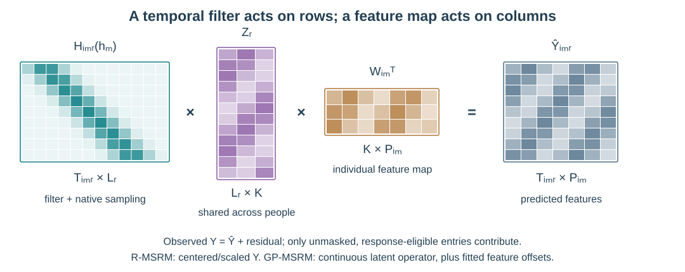
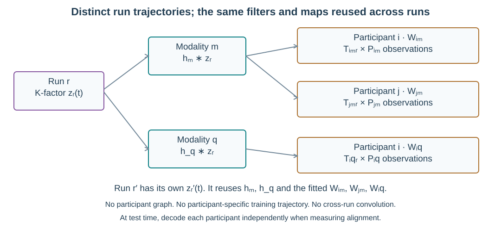
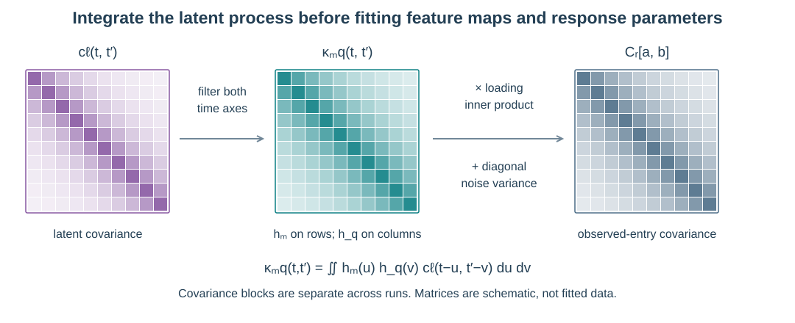

# From the model diagram to the mathematics

Both model families explain many observation streams through **one common latent response per run**, individual feature maps, and modality response filters. This page develops that shared structure, then shows where R-MSRM and GP-MSRM differ. The equations below use shared modality filters and exact latent sharing; the R pooling extensions are separate choices.

## Read the model from left to right

The response acts on the **time axis**. The feature map acts on the **feature axis**. Different feature counts and sampling clocks are allowed because each stream has its own evaluation operator and participant–modality map.

| Symbol | Meaning | Dimensions or sharing |
| --- | --- | --- |
| $i,m,r$ | Participant, modality, run | Names in the nested input dictionary |
| $n,f,k$ | Native observation row, measured feature, latent factor | Distinct indices |
| $X_{imr}$ | Observed values | $T_{imr}\times P_{im}$; time × feature |
| $t_{imrn}$ | Observation time | Native to each stream |
| $M_{imr}$ | Observed-entry mask | Same shape as $X_{imr}$ |
| $Z_r$ or $z_r(t)$ | Shared latent response | Grid values $L_r\times K$, or a continuous $K$-vector |
| $h_m(u)$ | Modality response filter | Shared over people, runs and factors in this baseline |
| $W_{im}$ | Participant–modality feature map | $P_{im}\times K$; reused across runs |

### What is reused across runs?

A shared run ID asserts a shared stimulus timeline. A new run has a new trajectory but reuses trained maps and filters. There is no convolution across run boundaries. Independently decoding two participants at test time gives separate estimates of the same modeled latent quantity; it does not add private trajectories to the generative model.

## R-MSRM: a grid and a regularized objective

R-MSRM standardizes observations using training-only statistics for each participant–modality pair, producing $Y_{imr}$. It represents the latent signal on a grid with spacing `latent_dt` and linearly interpolates between nodes. The model is

$$
Y_{imr}=H_{imr}(h_m) Z_r W_{im}^{\mathsf T}+E_{imr}.
$$

The matrix $H$ combines response integration and evaluation at the stream's native times. If $\varphi_{r\ell}$ is a linear interpolation basis function at latent node $\ell$,

$$
H_{imr,n\ell}=\int h_m(u)\varphi_{r\ell}(t_{imrn}-u)\,du.
$$

The latent grid is discretized; observation data are not resampled onto a common clock. $E$ is residual error, not a fitted noise-variance likelihood.

The exact-shared objective can be organized as

$$
\mathcal J =
\underbrace{\sum_{imrnf}c_{imrnf}
\left[Y_{imr}-H_{imr}Z_rW_{im}^{\mathsf T}\right]_{nf}^{2}}_{\text{balanced reconstruction}}
+\lambda_W\mathcal P_W+\lambda_Z\mathcal P_Z
+\lambda_T\mathcal P_T+\mathcal P_h.
$$

The coefficients $c$ balance participant–run pairs, available modalities, native-time integration weights and observed features. Masked or support-ineligible entries have zero weight. This prevents a stream from dominating simply because it has more features or more frequent samples.

For $A$ fitted participant–modality pairs and $R$ run grids,

$$
\mathcal P_W=\frac1A\sum_{im}\frac{\lVert W_{im}\rVert_F^2}{s_{im}},
\qquad
\mathcal P_Z=\frac1R\sum_r\sum_\ell a_{r\ell}\lVert z_{r\ell}\rVert^2,
$$

$$
\mathcal P_T=\frac1R\sum_r\frac1{\Delta d_r}
\sum_{\ell=1}^{L_r-1}\lVert z_{r,\ell+1}-z_{r\ell}\rVert^2.
$$

Here $\Delta$ is `latent_dt`, $d_r=(L_r-1)\Delta$ is the numerical grid duration, and $a_{r\ell}$ are duration-normalized trapezoid weights. Pair loading scaling uses $s_{im}=1$; feature scaling uses $s_{im}=P_{im}$. The three strengths correspond to `loading_ridge`, `latent_ridge` and `temporal_strength`. $\mathcal P_h$ contains any configured response penalties. Exact shared latent trajectories add no graph penalty.

Training alternates latent, loading and response updates. Predictions invert the stored preprocessing to return supplied data units. These are point estimates; the regularizers do not make this a posterior sampler. See [R settings](api-guide.md#r-msrm-settings).

## GP-MSRM: a continuous prior and filtered covariance

GP-MSRM instead puts a unit-variance Matérn-3/2 prior on each latent factor. Conditional on the shared parameters, factors and runs are independent a priori:

$$
\operatorname{Cov}[z_{rk}(t),z_{r'k'}(t')]
=\mathbf 1_{r=r'}\mathbf 1_{k=k'}c_\ell(t,t').
$$

The covariance $c_\ell$ and its `length_scale` are illustrated in the [kernel guide](temporal-kernels.md#the-latent-gp-kernel-matern-32). A numeric timescale is fixed; a bounded positive `Prior` allows learning one shared timescale in supported workflows.

In supplied observation units, with independent residual noise, the baseline is

$$
x_{imrf}(t)=b_{imf}+\sum_{k=1}^K w_{imfk}
\int h_m(u)z_{rk}(t-u)\,du+\epsilon_{imrf}(t),
\qquad \epsilon_{imrf}(t)\sim\mathcal N(0,v_{im}).
$$

Offsets $b$ and noise **variances** $v$ are persistent participant–modality parameters. GP-MSRM does not internally standardize observations. Optional run baselines and correlated residuals modify this baseline and have narrower supported inference scopes.

### Why filter the covariance twice?

Each of two observations is a filtered version of the same latent drive. Their covariance therefore contains both response filters:

$$
\kappa_{mq}(t,t')=
\int\!\int h_m(u)h_q(v)c_\ell(t-u,t'-v)\,du\,dv.
$$

For observations $a=(i,m,r,f,t)$ and $b=(j,q,r',g,t')$,

$$
\operatorname{Cov}(x_a,x_b\mid\theta)
=\mathbf 1_{r=r'}\left(\mathbf w_{imf}^{\mathsf T}\mathbf w_{jqg}\right)
\kappa_{mq}(t,t')+\mathbf 1_{a=b}v_{im}.
$$

The loading dot product controls feature relationships; the filtered covariance controls temporal relationships. The diagonal noise term is measurement variance. Matrix shading in the illustration is schematic, not an empirical covariance estimate.

### MAP, posterior sampling and prediction

The latent GP is marginalized when fitting the supported parameter targets. For eligible scalar observations in a run, the Gaussian negative log likelihood contains

$$
\frac12(x_r-\mu_r)^{\mathsf T}C_r^{-1}(x_r-\mu_r)
+\frac12\log|C_r|+\frac{N_r}{2}\log(2\pi).
$$

MAP adds the negative log prior and finds a parameter point. Posterior inference samples the supported parameter target. Latent responses are inferred conditionally afterward. Frozen MAP prediction holds training parameters fixed; posterior prediction can mix over parameter draws. Conditional uncertainty and parameter uncertainty are distinct.

`linear_algebra` chooses how these calculations are carried out. Dense and grouped paths target the same chosen covariance; state-space and spectral paths have explicitly documented response/approximation restrictions. Choosing a backend is independent of choosing MAP versus posterior inference.

## Connect the math to a modeling decision

| Scientific or computational choice | API setting | What changes |
| --- | --- | --- |
| Latent dimension | `features` | Number of columns in $Z$ and $W$ |
| R grid resolution | `latent_dt` | Latent interpolation basis and numerical grid |
| R temporal regularization | `temporal_strength` | Penalty on squared latent derivatives |
| GP latent timescale | `length_scale` | Prior correlation $c_\ell$ |
| Modality lag and smoothing | `Response(kernel, ...)` | Filtering operator $H$ or filtered covariance $\kappa$ |
| Fixed versus learned response | `estimate`, `fixed`, `bounds` | Which response parameters enter optimization/sampling |
| GP parameter uncertainty | `inference` | MAP parameter point or posterior draws |
| GP numerical representation | `linear_algebra` | Computation and approximation restrictions |

Rotations/sign changes can represent equivalent latent factors. Timing conventions and anchors help define reporting coordinates; they do not prove physiological timing. Strong prediction, successful optimization, response recovery and calibrated uncertainty are separate claims.

## White papers and figure provenance

The three model diagrams are reproduced from the September 18 implementation white papers in `shared-response-models`:

- [R-MSRM methods and exact objective](https://github.com/ljchang/shared-response-models/blob/dd009e519919d38e978d54de9eedc1b1c8b14a9f/docs/whitepaper/R_MSRM.md).
- [GP-MSRM probability model and covariance derivation](https://github.com/ljchang/shared-response-models/blob/dd009e519919d38e978d54de9eedc1b1c8b14a9f/docs/whitepaper/GP_MSRM.md).

Those are historical audits with earlier package names and inference limits. This guide adapts the model explanation to the current standalone API. In particular, the current supported posterior can use multiple factors, a learned shared timescale, and explicit structured-response quadrature. Use the [current capability matrix](capabilities.md) for supported combinations and separate validation boundaries. See [figure provenance](figure-provenance.md) for the source versions and reproduction commands.
