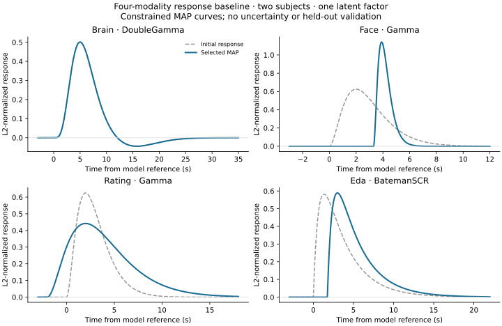

# Four-modality constrained MAP baseline

The small empirical model now passes the physical projected-gradient convergence
check from three starts. Two starts reach the same best solution. This supplies
a numerical baseline for brain double-gamma, face/rating gamma, and EDA Bateman
responses. Face and rating estimates reach response bounds, so sensitivity to
those bounds is the next modeling question.

Results are retained in [portable JSON](2026-09-22-gp-map-baseline-results.json).
The [fitting script](../../scripts/fit_gp_response_baseline.py) and
[validation script](../../scripts/check_gp_response_baseline.py) are research
tools; production inference and package defaults have not changed.

## Scope and model

The dataset is the first 180 seconds for s001 and s002, with five brain parcels,
all available face/rating features, and EDA only from the physiology stream.
Missing streams remain missing. There is one latent factor, 180 parameters,
7,108 included scalar observations, 307 modality/time nodes, and 26 states.
This is a small real-data baseline, not the full three-factor empirical model.

The model uses the [candidate configuration](../../scripts/gp_response_candidates.py):

- Brain: fixed canonical `DoubleGamma`, lag zero; defines the timing reference.
- Face and ratings: independent `Gamma(shape=3)` responses, learned scale and
  onset lag. Scale bounds are [0.3, 2] seconds; lag bounds are [-2, 6] seconds.
- EDA: learned `BatemanSCR` rise, decay, and lag, bounded by [0.3, 1.4],
  [1.5, 4], and [-2, 6] seconds, respectively.
- Fixed three-second GP length scale, unit latent variance, and the same
  loading, offset, noise, and response priors as the candidate configuration.

The state-space covariance tolerance remains explicitly `1e-6`. The declared
response-box error bound is approximately `2.22e-7`; this does not pass the
package's stricter default tolerance of `1e-7`.

## Optimization results

All rows use the same model and included observations. Lower objectives are
better. The qualification threshold is physical projected gradient `<= 1e-3`.

| Solver/run | Objective | Iterations | Physical projected gradient | Passes | Fit seconds |
| --- | ---: | ---: | ---: | --- | ---: |
| Public MAP search, one start | 8051.762577764 | 269 | 6.6003 | No | 77.1 |
| Bounded research solver, start 0 | 8051.465161519 | 206 | 6.93e-5 | Yes | 52.7 |
| Bounded research solver, start 1 | 8051.762577747 | 208 | 8.16e-6 | Yes | 54.9 |
| Bounded research solver, start 2 | 8051.465161519 | 225 | 4.63e-5 | Yes | 58.6 |

The public solver reported success through its relative objective-change test,
but the package's physical-gradient diagnostic correctly rejected convergence.
The research solver keeps loadings, offsets, and responses in physical
coordinates with explicit bounds; only noise variances use logarithmic
coordinates. It also uses tighter stopping settings and more L-BFGS history:
`ftol=1e-15`, `gtol=1e-8`, `maxcor=50`, `maxls=40`, `maxiter=1000`.
No transform Jacobian is added to the MAP objective. This experiment changes
both optimization coordinates and solver settings; it does not isolate their
individual contributions.

Starts use the existing prior-quantile initialization with seed 722. The two
best runs agree within `4e-12` in objective and `2.23e-6` in their largest
parameter difference. The third reaches a slightly higher constrained solution,
also with the positive brain-loading anchor on its boundary. Multiple starts
remain necessary; these checks do not prove global optimality. No polishing
was needed.

Preparation, derivative checks, and all three research fits took 179 seconds
after imports. These CPU timings are feasibility measurements, not an isolated
solver speed comparison or an NVIDIA acceleration result. Runs used Python
3.12.13, JAX 0.11.2, float64, eight allowed CPU cores per process, and one
OpenBLAS/OMP thread; the two solver experiments ran concurrently on separate
CPU affinity sets.

## Fitted response curves



| Stream | Selected parameters (seconds) | Peak time (seconds) | Positive-lobe FWHM (seconds) | Boundary status |
| --- | --- | ---: | ---: | --- |
| Brain | Fixed canonical double-gamma | 5.00 | 5.26 | Fixed |
| Face | Scale 0.300; onset 3.304 | 3.90 | 1.02 | Scale at lower bound |
| Ratings | Scale 2.000; onset -2.000 | 2.00 | 6.79 | Scale at upper bound; onset at lower bound |
| EDA | Rise 0.630; decay 3.066; onset 1.747 | 3.00 | 3.80 | All interior |

At the active response bounds, the raw objective gradients are +21.14 for face
scale, -18.94 for rating scale, and +2.10 for rating onset. Their signs favor
movement outside the current box: narrower face responses and broader, earlier
rating responses. A small projected gradient establishes constrained
stationarity; it does not establish that these bounds or physiological shapes
are appropriate.

Peak times refer to the model clock before the fixed brain HRF. They do not
identify absolute physiological latency. Curves are L2-normalized; their
heights do not compare observed signal amplitudes. No posterior uncertainty
has been estimated.

## Numerical validation at the selected solution

The grouped quadrature and state-space evaluations use exactly the same
parameters, included observations, timestamps, and observation keys.

| Grouped quadrature order | Absolute objective difference | Maximum absolute gradient difference |
| --- | ---: | ---: |
| 96 | 1.48e-6 | 1.18e-5 |
| 192 | 1.09e-7 | 8.55e-7 |

All seven physical response derivatives also agree with finite differences,
with maximum absolute difference `1.58e-7`. Boundary derivatives use second-order
one-sided probes. Three directional checks of the optimizer-coordinate chain
rule passed before fitting. These checks qualify the tested points; they do
not certify quadrature accuracy everywhere in the response box or posterior.

## Reproduce and continue

The local empirical loader and dataset are required, including pandas and
nibabel. Use a Bayesian installation with matplotlib for the figure:

```sh
PYTHONPATH=src JAX_ENABLE_X64=true JAX_PLATFORMS=cpu OPENBLAS_NUM_THREADS=1 OMP_NUM_THREADS=1 \
  python scripts/fit_gp_response_baseline.py --subjects s001,s002 \
  --parcels 5 --window 180 --features 1 --starts 3 --maxiter 1000 \
  --output local_data/gp-response-candidates-2026-09-22/core-map-bounded.json

PYTHONPATH=src JAX_ENABLE_X64=true JAX_PLATFORMS=cpu OPENBLAS_NUM_THREADS=1 OMP_NUM_THREADS=1 \
  python scripts/check_gp_response_baseline.py \
  local_data/gp-response-candidates-2026-09-22/core-map-bounded.json \
  --orders 96 192 \
  --output local_data/gp-response-candidates-2026-09-22/core-map-validation.json \
  --figure docs/assets/figures/gp-four-modality-response-baseline.svg
```

The ignored local results retain complete parameter vectors, all starts,
optimizer diagnostics, and derivative checks. The portable summary contains
aggregate diagnostics and response parameters, without participant observations.

The subsequent [bound-sensitivity experiment](2026-09-22-gp-response-bound-sensitivity.md)
tests wider response bounds while holding included observations fixed. Its best
wide-box solution has no active response constraints, but alternative timing
solutions remain close in objective. Different support envelopes change edge-row
eligibility, so that comparison refits the original box on the common rows.

Next, assess sensitivity to peak/width priors and compare gamma shapes 2/3/6
and Gaussian face/rating responses using held-out
prediction and training-only preprocessing. The current loader standardizes
the complete clip and inherits the existing splice-volume assumption, so this
baseline supplies no held-out performance claim.

Full-size fitting, NVIDIA profiling of these response families, parallel
filtering, and a converged small NUTS reference for Gibbs remain subsequent
steps. This experiment establishes a constrained MAP baseline, not posterior
convergence or predictive superiority of gamma responses.
