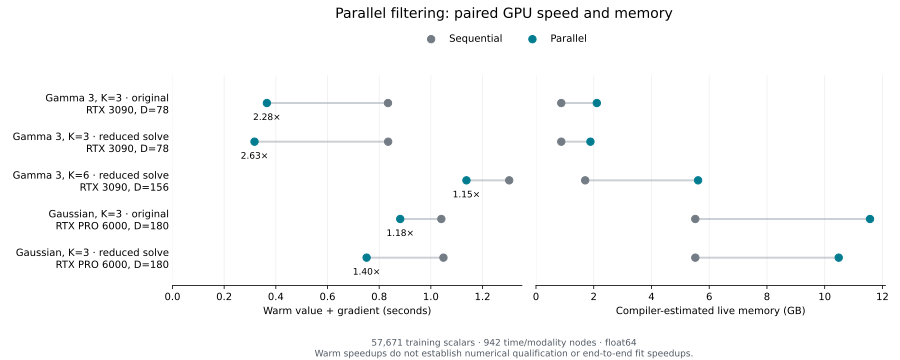

# Parallel GP filtering: higher-factor qualification

The parallel filter remains a research implementation. Moving to three factors
and all 100 brain parcels preserves useful gamma speedups, but reveals
low-noise derivative failures. Integration into the public estimator is deferred
until those failures are resolved. No production inference defaults changed.

This follows the [one-factor held-out comparison](2026-09-22-gp-response-holdout.md).
The new work separates numerical qualification and computational scaling from
response-family selection. It does not add new fitted models, held-out scores,
or evidence of posterior convergence.

## Measurements

<!-- MEASUREMENTS:START -->

| Model / initialization | GPU | States | Sequential (s) | Parallel (s) | Speedup | Points passing |
| --- | --- | ---: | ---: | ---: | ---: | ---: |
| Gamma 3, K=3, original | RTX 3090 | 78 | 0.834 | 0.365 | 2.28x | 7/8 |
| Gamma 3, K=3, reduced solve | RTX 3090 | 78 | 0.835 | 0.318 | 2.63x | 7/8 |
| Gamma 3, K=6, reduced solve | RTX 3090 | 156 | 1.303 | 1.138 | 1.15x | 7/8 |
| Gaussian, K=3, original | RTX PRO 6000 | 180 | 1.041 | 0.881 | 1.18x | 7/8 |
| Gaussian, K=3, reduced solve | RTX PRO 6000 | 180 | 1.049 | 0.751 | 1.40x | 7/8 |

| Model / initialization | Compile sequential / parallel (s) | Memory sequential / parallel (GB) | Estimated break-even evaluations |
| --- | ---: | ---: | ---: |
| Gamma 3, K=3, original | 22.9 / 130.6 | 0.88 / 2.11 | 231 |
| Gamma 3, K=3, reduced solve | 23.0 / 129.7 | 0.88 / 1.89 | 207 |
| Gamma 3, K=6, reduced solve | 23.4 / 122.8 | 1.70 / 5.61 | 603 |
| Gaussian, K=3, original | 71.0 / 421.2 | 5.52 / 11.57 | 2204 |
| Gaussian, K=3, reduced solve | 71.2 / 412.0 | 5.52 / 10.49 | 1148 |

Break-even counts divide extra compilation/lowering time by the measured per-evaluation saving. They assume reuse of the same compiled function and are estimates, not measured fitting durations.

<!-- MEASUREMENTS:END -->



Every speedup compares sequential and parallel value-and-gradient evaluation
on the **same GPU, data, response realization, and parameter vector** within
that row. Timings use float64 and the median of three warm evaluations at the
first deterministic initialization. Gamma runs use the RTX 3090; Gaussian
runs use the RTX PRO 6000. Cross-family times therefore do not establish a
controlled family speed ratio. The two gamma initialization variants were
measured in separate processes with a sequential reference in each process.

Compilation excludes lowering and first execution. Memory is the compiler's
estimated live argument/output/temporary allocation, not a measured process
or device peak. These estimates omit allocator reservations, compiler/runtime
overhead, other executables, and some persistent storage. Parallel filtering
uses more memory than the sequential checkpointed recurrence.

The earlier one-factor measurements used five brain parcels. Their speedups
are not a controlled factor-only scaling curve for this larger dataset.
The current three- and six-factor gamma runs use identical observations.
Observed feature count and latent factor count are separate scaling dimensions:
node grouping reduces repeated features to K-dimensional sufficient statistics,
whereas each added latent factor enlarges the state. More parcels therefore
do not increase state dimension in the way that more factors do.

## What changed in the prototype

The [original prefix filter](../../scripts/benchmark_gp_parallel_filter.py)
uses full-state observation solves. The new optional `observation_solve="functional"`
uses the Woodbury identity to solve in the K-dimensional observed-functional
space, retaining a Joseph-form covariance update. It does not invert loading
precision or process covariance, preserving support for deficient loading
rank and deterministic transitions. Temporal message combinations still use
full-state solves.

The associative-scan formulation follows
[Särkkä and García-Fernández, *Temporal Parallelization of Bayesian Smoothers*](https://arxiv.org/abs/1905.13002).
Reduced dependency depth does not eliminate matrix arithmetic, compilation,
or memory costs. Both implementations reuse the production residual-based
likelihood score rather than subtracting large observation quadratics.

## Numerical qualification

The [qualification runner](../../scripts/qualify_gp_parallel_scaling.py) evaluates
eight predeclared points for each case: two deterministic initializations,
all response parameters at 0.1% and 99.9% of their bounds, noise variances
of `1e-3` and `1e-6`, rank-one loadings, and zero loadings. The two boundary
points are stress probes, not exhaustive coverage of all parameter corners.
Low-noise trials keep the same empirical observations, which need not be
plausible under those parameters.

The gate requires finite values and gradients, objective error at most
`1e-6 + 1e-9*abs(reference)`, and **each** gradient component's error at most
`1e-5 + 1e-7*abs(reference component)`. These mixed tolerances were specified
before execution. The results also retain absolute errors, because relative
agreement far from an optimum is not a MAP convergence certificate.

The extreme low-noise failures must not be hidden by averaging errors across
parameters or by the good agreement of the likelihood alone. In particular,
the observed gamma failures prevent qualification across the declared noise
prior's support. No noise floor, covariance jitter, or prior change was added
to make the gate pass.

An [independent small-fixture check](../../scripts/check_gp_parallel_numerics.py)
builds a dense observation covariance using the **same response realization**.
This isolates filter arithmetic from response approximation error. It tests
both arbitrary observations and coherent observations simulated from that
model at noise variance `1e-6`. Sequential, original parallel, and reduced-solve
parallel objectives and derivatives are compared with the dense reference.
The synthetic data are retraced after replacement so compiled functions use
the correct observations.

<!-- NUMERICS:START -->

For the coherent low-noise synthetic draw, errors against the dense same-realization oracle are:

| Fixture | Filter | Objective absolute error | Maximum scaled gradient error |
| --- | --- | ---: | ---: |
| Gamma, D=78 | Sequential | 2.69e-09 | 0.0157 |
| Gamma, D=78 | Original parallel | 0.00026 | 1.95e+03 |
| Gamma, D=78 | Reduced-solve parallel | 5.8e-06 | 666 |
| Gaussian, D=180 | Sequential | 6.49e-10 | 0.056 |
| Gaussian, D=180 | Original parallel | 2.83e-06 | 440 |
| Gaussian, D=180 | Reduced-solve parallel | 5.23e-08 | 0.394 |

A scaled gradient error greater than one fails the componentwise gate. The reduced solve passes this small Gaussian draw but still fails the gamma draw. These fixtures use the candidate configuration's native scale/lag bounds, so passing one does not establish full empirical-box qualification.

<!-- NUMERICS:END -->

This supports treating the failure as a numerical problem. A public backend
needs stable derivatives as well as ordinary-point likelihood agreement.
The smaller solve helps, but does not complete that qualification. The
response approximation itself also needs an error assessment appropriate
to noise level; agreement between two filters does not provide one.

## Dataset and reproducibility

All empirical probes use s001/s002, a 500-second window, 100 brain parcels,
and the original predeclared modality holdouts. The shared training set has
57,671 scalar observations at 942 exact modality/time nodes. The three-factor
models have 1,106 parameters; the six-factor gamma model has 1,925. Training
values, feature keys, masks, and times match across candidates, verified by
their common observation hash.

Brain retains fixed DoubleGamma; EDA retains learned BatemanSCR. Face and
ratings use either fixed-shape gamma-3 responses or Gaussian responses, with
the earlier matched FWHM/peak priors and support restrictions. Pulse and
respiration remain outside this comparison. The GP timescale is fixed at
three seconds. Training-only standardization and its leakage checks are
inherited from the earlier validation protocol.

The [portable results](2026-09-22-gp-parallel-scaling-results.json) contain
per-point errors, timing repeats, compilation estimates, source hashes, and
the synthetic checks. Participant observations and loadings are not exported.
Raw logs remain in ignored `local_data/gp-parallel-scaling-2026-09-22/`.

With the same Bayesian CUDA installation, local loader, and dataset:

```sh
PYTHONPATH=src JAX_ENABLE_X64=true JAX_PLATFORMS=cuda \
  XLA_PYTHON_CLIENT_PREALLOCATE=false OPENBLAS_NUM_THREADS=1 OMP_NUM_THREADS=1 \
  timeout 900 python scripts/qualify_gp_parallel_scaling.py \
  --candidate gamma3 --features 3 --stress --observation-solve functional \
  --output local_data/gp-parallel-scaling-2026-09-22/gamma3-k3-functional.json
```

Select one GPU with `CUDA_VISIBLE_DEVICES` before launching. Repeat with
`--features 6` for gamma and `--candidate gaussian --features 3` for Gaussian;
use `--observation-solve full` for the original implementation. Each timed
process has eight CPU cores and one OpenBLAS/OMP thread. Separate-GPU jobs
may overlap, so machine-wide compilation contention remains a timing limitation.
Observed runs use Python 3.12.13 and JAX 0.11.2.

Run the small-fixture check on CPU with `--family gamma` and `--family gaussian`.
Then `scripts/summarize_gp_parallel_scaling.py` verifies that all five GPU
cases and numerical checks completed before exporting the report data/plots.

## Larger prediction comparison is prepared

The research fitting/scoring runner now accepts `--features` and `--fold`.
Prediction retains the **full factor covariance**, including off-diagonal
terms, when computing each feature's predictive variance. Its one-factor
behavior is preserved. Three-factor predictions agree with the existing
production per-feature API on a separate fixture, and canonical response
derivatives pass finite-difference checks.

Two additional validation schedules are declared before fitting or scoring:

| Fold | Brain | Face | Ratings | EDA |
| --- | --- | --- | --- | --- |
| Original | [220, 240) | [260, 280) | [300, 320) | [340, 360) |
| Rotated | [260, 280) | [300, 320) | [340, 360) | [220, 240) |
| Late | [300, 320) | [340, 360) | [380, 400) | [260, 280) |

All times are seconds. These are correlated within-recording validation folds,
not an independent final test set. They continue to measure missing-block
smoothing with other modalities available, not forecasting.
Preparation was checked on all three full-parcellation folds: gamma and
Gaussian have identical parameter names and training rows within each fold,
and the preprocessing leakage checks pass. Original/rotated hold out 3,053
scalars each; late holds out 3,054 because it includes one additional EDA value.

```sh
PYTHONPATH=src JAX_ENABLE_X64=true JAX_PLATFORMS=cuda \
  XLA_PYTHON_CLIENT_PREALLOCATE=false \
  python scripts/compare_gp_response_families.py --candidate gamma3 \
  --features 3 --parcels 100 --fold rotated --starts 3 \
  --output local_data/gp-response-expanded/gamma3-k3-rotated.json
```

This prepared comparison uses the existing sequential production filter.
It has not been run here. Keep convergence checks and simple predictive
baselines; do not select a response family from computational speed alone.

The weak speedup at six factors argues for investigating state dimension and
matrix structure alongside temporal parallelism. The current transition
matrices repeat the same per-factor block, but the update materializes full
state matrices. Exploiting those blocks and reducing Gaussian response state
size are concrete candidates for separate accuracy/performance experiments;
no speedup from either is established here. Stable parallel derivatives and
lower compilation/memory costs remain prerequisites for a public parallel
backend. The expanded prediction comparison can proceed independently using
the existing sequential backend.
