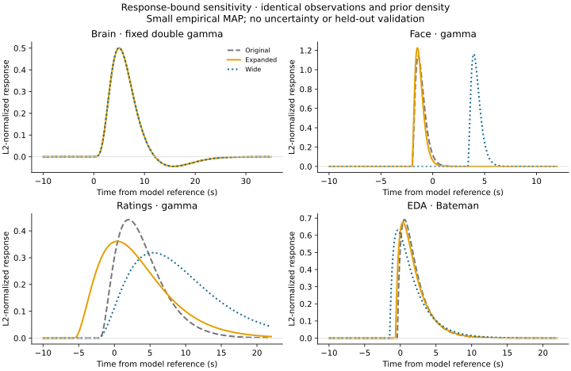

# Response-bound sensitivity on identical observations

Wider bounds resolve the active response constraints at the best solution found:
face settles at about one second FWHM, and ratings at about thirteen seconds.
Several different timing solutions remain close in objective, so this does not
establish a unique physiological response. All eleven fits passed their
constrained physical-gradient checks.

This follows the [converged small MAP baseline](2026-09-22-gp-map-baseline.md).
Brain remains fixed double-gamma and EDA remains
learned Bateman. Face and ratings remain independent shape-three gamma responses.
Production inference and response defaults are unchanged.

The [research runner](../../scripts/investigate_gp_response_bounds.py) fits three
nested parameter boxes against one fixed density. This is a sensitivity study,
not a comparison between response families or a held-out evaluation.
Aggregate diagnostics and response parameters are retained in the
[portable results](2026-09-22-gp-response-bound-sensitivity-results.json).

## Fixed observations and density

The same two subjects, first 180 seconds, five brain parcels, and one latent
factor are used throughout. All face/rating channels remain included; EDA is
available for s001. Wider rating support makes additional edge rows ineligible:

| Stream | Earlier baseline observations | Common observations in every new fit |
| --- | ---: | ---: |
| Brain | 605 | 605 |
| Face | 2,480 | 2,480 |
| Ratings | 3,968 | 2,176 |
| EDA | 55 | 55 |
| Total | 7,108 | 5,316 |

The common set has 251 modality/time nodes, 180 parameters, and 26 states.
Observation values, times, and feature keys are identical across the new fits;
the runner hashes them and verifies they are a subset of the original eligible
observations. The wider rating support envelope is [-10, 102.725] seconds,
which leaves rating observations approximately between 103 and 170 seconds
in this short clip. The loss of 1,792 rating scalars makes this a deliberately
conservative, limited-data comparison.

The widest response box defines the prior truncation and normalization once.
The original and expanded boxes restrict only the optimizer and the corresponding
projected-gradient check. The original-box optimum is therefore equivalent to
using its own normalized truncated priors on these same observations, since
the normalization difference is constant within that box. This construction
avoids attributing a change in prior normalization to improved data fit.
Objective values are comparable across this experiment's rows; they are not
comparable to the earlier 7,108-observation objective.

| Box | Face scale | Face onset | Rating scale | Rating onset |
| --- | --- | --- | --- | --- |
| Original | [0.3, 2] | [-2, 6] | [0.3, 2] | [-2, 6] |
| Expanded | [0.1, 2] | [-2, 6] | [0.3, 3] | [-6, 6] |
| Wide | [0.05, 2] | [-2, 6] | [0.3, 4] | [-10, 6] |

All intervals are in seconds. The underlying response priors remain the
candidate model's lognormal scale and normal onset priors. Brain response,
EDA bounds/priors, GP length scale, and loading/offset/noise priors remain fixed.
The state-space covariance error bound over the widest box is `4.27e-7`, within
the experiment's explicit `1e-6` tolerance.

## Optimization and numerical checks

The solver uses physical loading/offset/response coordinates and log noise
variance, with no MAP transform Jacobian. All boxes reuse three initial vectors
from seed 722, clipped once to the original box. Expanded and wide fits also
start from the preceding box's best solution. The stopping settings match the
successful research baseline: L-BFGS-B with `ftol=1e-15`, `gtol=1e-8`,
`maxcor=50`, `maxls=40`, and at most 1,000 iterations per start. Qualification
uses physical projected gradient `<= 1e-3`.

Independent grouped quadrature orders 96, 192, and 384 are evaluated at each selected
solution using the same observations and priors. Response derivatives are also
checked by finite differences. These are checks at the fitted points; they do
not certify the entire parameter box or establish posterior convergence.

| Box | Order-384 objective difference | Order-384 maximum gradient difference | Maximum response finite-difference error |
| --- | ---: | ---: | ---: |
| Original | 3.56e-7 | 6.53e-6 | 2.42e-7 |
| Expanded | 3.06e-7 | 2.40e-6 | 1.70e-7 |
| Wide | 6.60e-7 | 7.04e-6 | 4.33e-8 |

The broader rating response benefits from higher quadrature order. At the wide
solution, objective differences from state-space decrease from `1.08e-4` at
order 96 to `6.27e-6` at 192 and `6.60e-7` at 384. The remaining gradient
differences are below the `1e-3` convergence threshold. Agreement at this level
is sufficient for the reported stationarity check, not an exact-equality claim.

## Results

| Optimization box | Best objective | Physical projected gradient | Active response bounds |
| --- | ---: | ---: | --- |
| Original | 6255.883502 | 2.07e-5 | Face scale/onset; rating scale/onset |
| Expanded | 6248.677299 | 1.87e-5 | Face onset; rating scale |
| Wide | 6247.479295 | 1.43e-5 | None |

The best wide-box objective improves by 8.404 on this fixed density. This is an
in-sample MAP improvement, not evidence of better held-out performance or a
Bayes factor. The common prior density also lets the original and expanded
solutions be checked against the widest optimization box, where they retain
directions of improvement.

| Stream | Best wide-box parameters (seconds) | Peak time (seconds) | Positive-lobe FWHM (seconds) |
| --- | --- | ---: | ---: |
| Brain | Fixed double-gamma | 5.00 | 5.26 |
| Face | Scale 0.289; onset 3.378 | 3.95 | 0.98 |
| Ratings | Scale 3.853; onset -2.277 | 5.43 | 13.08 |
| EDA | Rise 0.602; decay 2.561; onset -1.506 | -0.37 | 3.33 |



Three qualifications matter for interpreting these curves:

- The best wide-box solution was found by one of the independent starts. Two
  other stationary solutions are only 0.364 and 0.683 objective units higher;
  one has the positive brain-loading anchor at its bound, and the other has
  face onset at -2 seconds. These are distinct local solutions, not uncertainty
  intervals. The experiment does not prove the global optimum or determine
  how much posterior probability each solution contains.
- With the original response bounds, removing the edge rating observations
  changes the selected face peak from approximately +3.90 seconds in the
  earlier baseline to -1.40 seconds here. EDA timing also moves substantially.
  Optimization convergence does not make timing robust to the analyzed rows.
- Face channels are sampled every two seconds in this loader, whereas the
  fitted response is about one second wide. That estimate needs uncertainty
  and recovery checks before being treated as resolved temporal detail.

All peak times use the model clock before the fixed brain HRF. Negative onset
or peak estimates are not evidence that a physiological response precedes its
cause. The fixed reference response, latent timescale, restricted factor count,
and limited data all remain part of the model assumptions.

Preparing and fitting the eleven starts took 354 seconds after imports on CPU;
validation is additional. Python 3.12.13 and JAX 0.11.2 used float64, CPU affinity
0–7, and one OpenBLAS/OMP thread. No polishing was needed. State dimension stays
at 26 even when rating width grows: learned gamma scales change the dynamics
without adding response states. This is useful for the efficiency investigation,
but the run does not measure an NVIDIA speedup or compare Gaussian fitting time.

## Next decision

The subsequent [longer-window held-out comparison](2026-09-22-gp-response-holdout.md)
is now complete. The candidates have similar held-out errors and limited
improvement over a training-mean reference in the small one-factor model.
It also measures parallel-filter gains for both gamma and Gaussian responses.
The wider-box result here remains a constrained small-window diagnostic.

Use the wider gamma box as an exploratory candidate for a longer-window,
held-out comparison against Gaussian responses and gamma shapes 2/3/6. Retain
multiple starts and inspect alternative timing modes. Longer recordings are
particularly important here because the shared support requirement removed
45% of the previously eligible rating scalars from the short test.

Compare prediction and response recovery with training-only preprocessing,
common eligible observations, and sensitivity to priors on peak time and width.
Broader modality and factor coverage should be checked before interpreting
the present latency estimates. GPU profiling can use the now-qualified small
gamma configuration while those modeling checks proceed; no response-family
default is selected by this experiment.

## Reproduce

The ignored empirical loader, EmotionPictures dataset, and Bayesian Python
environment with pandas, nibabel, and matplotlib must be available.

```sh
PYTHONPATH=src JAX_ENABLE_X64=true JAX_PLATFORMS=cpu OPENBLAS_NUM_THREADS=1 OMP_NUM_THREADS=1 \
  python scripts/investigate_gp_response_bounds.py \
  --subjects s001,s002 --window 180 --parcels 5 --features 1 --starts 3 \
  --output local_data/gp-response-candidates-2026-09-22/core-bounds-sensitivity.json \
  --figure docs/assets/figures/gp-response-bound-sensitivity.svg
```

The JSON and adjacent per-box NPZ files retain all parameter vectors and starts
under ignored `local_data`. Add `--check-only` to repeat validation and plotting
from those saved fits. The existing loader's full-clip standardization and
splice-volume assumption are inherited here. Held-out family selection still
requires training-only preprocessing and identical eligible test observations.
