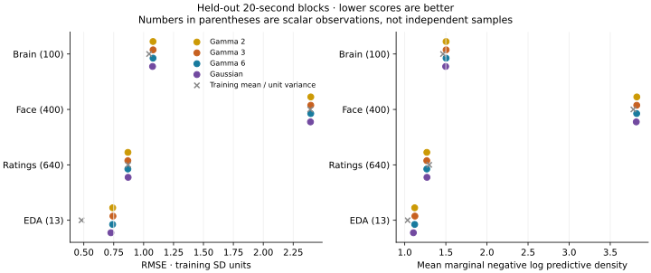

# Longer-window response-family validation and GPU timings

All four candidates converged, but their held-out predictions are very
similar and generally do not beat the training-mean baseline in this small
one-factor configuration. This fold does not justify selecting a new response
family. The performance result is more actionable: parallel filtering gives
approximately **4.8x faster gamma-3 gradients** and **2.0x faster Gaussian
gradients** on the RTX 3090, with numerical agreement at the fitted points.

This experiment follows the [response-bound sensitivity study](2026-09-22-gp-response-bound-sensitivity.md).
It compares gamma shapes 2, 3, and 6 with Gaussian face/rating responses, while
retaining fixed double-gamma brain and learned Bateman EDA responses.
The [comparison runner](../../scripts/compare_gp_response_families.py) and
[shared protocol](../../scripts/gp_response_holdout.py) are research tools.
Production inference and response defaults are unchanged.
See the [portable results](2026-09-22-gp-response-holdout-results.json) for
per-start diagnostics, scores, and numerical checks.

Follow-up: [higher-factor parallel-filter qualification](2026-09-22-gp-parallel-scaling.md)
tests full brain coverage, compilation/memory costs, and low-noise numerical limits.

## Held-out results

RMSE below is in training-standard-deviation units. The training-mean reference
predicts zero after training-only standardization.

| Candidate | Brain | Face | Ratings | EDA |
| --- | ---: | ---: | ---: | ---: |
| Training mean | 1.0461 | 2.3927 | 0.8703 | 0.4811 |
| Gamma 2 | 1.0784 | 2.3971 | 0.8687 | 0.7415 |
| Gamma 3 | 1.0789 | 2.3970 | 0.8680 | 0.7436 |
| Gamma 6 | 1.0786 | 2.3967 | 0.8682 | 0.7408 |
| Gaussian | 1.0745 | 2.3947 | 0.8704 | 0.7261 |

Gaussian has slightly smaller errors on brain, face, and EDA; gamma has slightly
smaller rating errors. Differences between families are small relative to the
failure to improve consistently on the reference baseline. Macro marginal NLPD
is 1.9290/1.9294/1.9282/1.9225 for gamma 2/3/6/Gaussian, versus 1.8949 for the
training-mean/unit-variance reference. These are descriptive results from one
fold, not statistically established family differences.



The [fitted response curves](../assets/figures/gp-response-holdout-responses.svg)
show another unresolved limitation. All four candidates reach the rating FWHM
upper bound of 16 seconds and EDA's decay/onset bounds (4 and -2 seconds).
Face FWHM is approximately 0.39–0.48 seconds, shorter than its two-second
sampling interval, with peak estimates around 4.4–4.7 seconds. These point
estimates need recovery and uncertainty checks before physiological interpretation.
The interior solution from the earlier short-window sensitivity experiment does
not establish robustness on this longer window or under the matched priors.

## Convergence and accuracy

All twelve starts pass the `1e-3` projected physical-gradient criterion in the
common FWHM/peak coordinates. Numerical quadrature checks below independently
evaluate the selected MAPs on the same observations and with the same priors.

| Candidate | Selected projected gradient | Order-384 objective difference | Maximum gradient difference |
| --- | ---: | ---: | ---: |
| Gamma 2 | 4.41e-5 | 4.81e-7 | 1.26e-6 |
| Gamma 3 | 2.78e-5 | 1.82e-6 | 1.36e-6 |
| Gamma 6 | 6.82e-5 | 1.08e-6 | 2.73e-6 |
| Gaussian | 5.68e-5 | 3.59e-8 | 7.82e-7 |

This agreement supports the reported MAP qualification. It does not prove a
global optimum, full-box numerical accuracy, or posterior convergence. Some
starts find different local solutions. The best Gaussian solution also has
the positive brain-loading anchor at its bound.

## Measured computational costs

All timings are float64. Warm timings are medians of three completed
likelihood-and-gradient evaluations. The CPU/PRO 6000 comparison uses the
same canonical initial vector and observations within each family.

| Family | Sequential CPU | Sequential RTX PRO 6000 | GPU speedup |
| --- | ---: | ---: | ---: |
| Gamma 3 | 0.677 s | 0.598 s | 1.13x |
| Gaussian | 4.135 s | 0.787 s | 5.25x |

The parallel comparison uses the same GPU, same density, same fitted parameter
vector, and same observations within each row:

| Family | States | RTX 3090 sequential | RTX 3090 parallel | Warm speedup |
| --- | ---: | ---: | ---: | ---: |
| Gamma 3 | 26 | 0.715 s | 0.149 s | 4.8x |
| Gaussian | 60 | 1.158 s | 0.573 s | 2.0x |

At the fitted gamma-3 point, the objective difference is `3.64e-12` and maximum
gradient difference is `4.62e-12`. For Gaussian they are zero at displayed
precision and `6.14e-11`. The two initialization points also agree, with maximum
gradient differences below `7.5e-10` across both families.

Compilation costs matter: the Gaussian probe compiled its sequential function
in 25.9 seconds and parallel function in 81.3 seconds, excluding lowering.
For gamma-3 the corresponding costs are about 11 and 26 seconds. These are
warm-gradient speedups, not measured full-fit or NUTS speedups. The response
states here are 26/60 with one factor; this result does not resolve the earlier
Gaussian prefix compilation timeout at dimension 150.

The completed three-start fit pipelines took approximately 434/537/816 seconds
on CPU for gamma 2/3/6, and 608 seconds on the PRO 6000 for Gaussian. These
include preparation, compilation, initial timing/derivative checks, and fitting,
but exclude prediction. They ran concurrently on separate resources, have
different iteration counts, and are not a controlled end-to-end speedup ratio.
Gamma's 24–32 states remain cheaper than the 60-state Gaussian comparator;
this alone does not establish a preferable scientific model.

## What to do next

Prioritize qualification and integration of an optional parallel filter,
including higher factor counts, extreme bounds, high signal-to-noise cases,
compilation, and memory. It preserves the tested likelihood and therefore
offers an optimization path without requiring a response-family decision.

For predictive validity, compare additional factors and fuller brain coverage
on additional predeclared blocks, while retaining simple baselines and training-only
preprocessing. The present one-factor/five-parcel setup supplies little evidence
of useful cross-modal reconstruction in these held-out blocks. Response/GP
timescale confounding and active rating/EDA bounds also need investigation.
Do not widen bounds repeatedly and then present performance on this same fold
as an independent test. Family selection and a converged NUTS/Gibbs comparison
remain separate qualification tasks.

## Validation protocol

The recording window is extended from 180 to 500 seconds for s001 and s002.
There are five brain parcels, all face/rating channels, one latent factor, and
180 fitted parameters. EDA is available only for s001. Every candidate uses
exactly 19,101 training scalars at 942 modality/time nodes and the same 1,153
held-out scalars. Values, feature keys, masks, and timestamps are hashed to
verify the comparison.

| Held-out modality | Time block (seconds; end excluded) | Held-out scalar observations |
| --- | --- | ---: |
| Brain | [220, 240) | 100 |
| Face | [260, 280) | 400 |
| Ratings | [300, 320) | 640 |
| EDA | [340, 360) | 13 |

Each block removes that modality for every available subject. Other modalities
and observations before and after the block remain available. This tests
missing-block reconstruction by smoothing; it is not forecasting or prediction
for unseen participants. Blocks were specified before inspecting their scores.
This is one validation fold, not an independent final test set. Scalar counts
do not represent independent samples.

Training and validation observations are restricted to the common support-eligible
rows across all four candidate families and parameter boxes. This is conservative:
the common rating support envelope is approximately [-44.77, 152.44] seconds,
so the shared eligible rating window is approximately 153–455 seconds. The
original recording domain is preserved when selecting these rows; masking early
rows does not inadvertently shift the domain and trim them a second time.

## Comparable priors and preprocessing

Response priors are defined on physical positive-lobe FWHM and peak time:

- FWHM: `LogNormal(log(3.4), 0.7)`, truncated to [0.2, 7] seconds for face and
  [1, 16] seconds for ratings.
- Peak time: `Normal(2, 3)` seconds, truncated to [-4, 10] for face and [-4, 12]
  for ratings.

These priors are the same across families. MAP density is defined in these
common physical coordinates. For integer gamma shape k, FWHM is a constant
times scale and peak is `onset + (k-1)*scale`. Gaussian FWHM is
`sqrt(8*log(2))*width`, and its lag is the peak. The native likelihood uses the
corresponding scale/lag parameters, but its placeholder response priors are
replaced by the common FWHM/peak density. No log-coordinate optimization
Jacobian is added to MAP. These settings differ from the earlier independent
native-scale/onset priors, so its raw MAP objectives are not comparable here.

Brain shape, EDA priors/bounds, fixed three-second latent GP length scale,
continuous L2 response normalization, and loading/offset/noise priors remain
the candidate configuration. Each gamma candidate uses the same integer shape
for face and ratings; mixed shape combinations are not screened in this fold.

Means and scales are learned from common eligible training observations alone.
The loader's previous full-clip affine standardization is canceled by this
training-only restandardization. The implementation verifies invariance under
another affine transformation, and verifies that adding 10,000 to held-out
values changes no training statistics. Constant training features would raise
an error. Existing motion masks, physiology binning, and the splice-volume
assumption are inherited from the empirical loader.

Three initializations per family use seed 722. Optimization uses the research
bounded L-BFGS-B solver with physical FWHM/peak coordinates and log noise
variance. A fitted point qualifies at projected physical gradient `<= 1e-3`;
an optimizer's success flag alone is insufficient. Restarts are selected by
training objective before held-out prediction. The common-prior gradient
implementation is checked by finite differences.

Predictions use the production state-space smoother once per modality,
followed by each feature's own loading, offset, and observation variance.
The [implementation check](../../scripts/check_gp_response_holdout.py) verifies
this batched calculation against the existing per-feature prediction API.
The maximum difference in its fixture is `5.55e-16`; maximum response derivative
finite-difference error is `2.38e-7`.

Scores are RMSE in training-standard-deviation units and mean marginal negative
log predictive density (NLPD), including observation noise. Lower is better.
Macro averages weight the four modalities equally; the EDA estimate has only
13 held-out values. Marginal NLPD is not a joint predictive log density.
Predictive uncertainty conditions on MAP parameters and training statistics.
The reference baseline predicts each feature's training mean and unit variance.

## Reproduce

Use a Bayesian installation with float64, pandas, nibabel, matplotlib, and the
local empirical loader/dataset. For each of `gamma2`, `gamma3`, `gamma6`, and
`gaussian`, run:

```sh
PYTHONPATH=src JAX_ENABLE_X64=true JAX_PLATFORMS=cpu OPENBLAS_NUM_THREADS=1 OMP_NUM_THREADS=1 \
  python scripts/compare_gp_response_families.py --candidate gamma3 --starts 3 \
  --output local_data/gp-response-holdout-2026-09-22/gamma3-cpu.json

PYTHONPATH=src JAX_ENABLE_X64=true JAX_PLATFORMS=cpu OPENBLAS_NUM_THREADS=1 OMP_NUM_THREADS=1 \
  python scripts/compare_gp_response_families.py --candidate gamma3 \
  --action validate --order 384 \
  --output local_data/gp-response-holdout-2026-09-22/gamma3-cpu.json
```

Use `--action probe` and a separate output path for preparation and four timed
likelihood/gradient evaluations. GPU runs require `JAX_PLATFORMS=cuda`, an
available `CUDA_VISIBLE_DEVICES`, and `XLA_PYTHON_CLIENT_PREALLOCATE=false`.
Observed GPU timings use the existing JAX 0.11.2 CUDA environment, Python
3.12.13, and float64. CPU processes each have eight allowed cores and one
OpenBLAS/OMP thread. Concurrent fits run on separate CPU affinity sets/GPUs;
fit durations across devices are not isolated speedup ratios.

The [parallel probe](../../scripts/benchmark_gp_response_holdout_parallel.py)
uses the earlier research prefix-filter implementation with the same likelihood,
responses, observations, and priors. Pass `--candidate` and `--fit` to check
two initialization points and the selected MAP on the same GPU. Compilation
and warm execution are reported separately. This does not enable a production
parallel backend or establish end-to-end sampler speedups.
