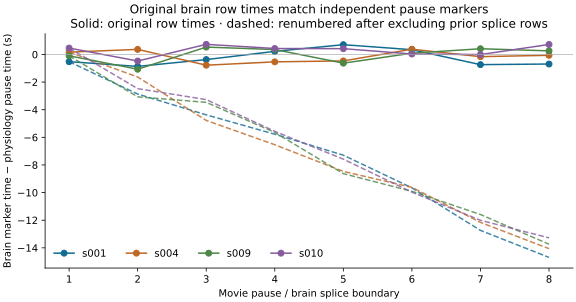

# Brain clock and GP calibration audit

**The historical research loader accumulates a brain timestamp shift of up to
16 seconds.** After dropping eight splice-marked rows, it puts the remaining
252 rows on a new contiguous two-second grid. Independent physiology pause
markers support keeping the original row times. This makes the earlier
response-family rankings provisional and motivates a
[six-fit repeat with preserved timestamps](2026-09-23-gp-clock-preserved-fits.md).

The [aggregate audit and diagnostics](2026-09-23-gp-clock-calibration-results.json)
contain clock metadata, training-innovation summaries, and predictive diagnostics.
Raw observations, fitted loadings, and individual predictions remain in ignored
local storage. No production inference defaults change.

## Independent timing evidence

The supplied README describes 252 brain volumes and calls `splices` a boundary
marker. The actual images and metadata contain 260 rows, of which eight have
that flag. Matching physiology pause boundaries against those brain markers
gives the following maximum absolute discrepancies:

| Subject | Original row times | After renumbering retained rows |
| --- | ---: | ---: |
| s001 | 0.864 s | 14.692 s |
| s004 | 0.776 s | 14.060 s |
| s009 | 1.068 s | 13.738 s |
| s010 | 0.734 s | 13.276 s |

Each comparison uses eight boundaries. These four subjects provide independent
clock metadata; the response fits still use only s001 and s002. There is no
physiology for s002. The final retained brain observations shift by 16 seconds
under renumbering, after all eight exclusions.

This supports separating observation exclusion from timestamp assignment.
The user's working interpretation is that the extra eight volumes belong at the
end and `splices` marks where gaps were already removed. Following that
clarification, the [research adapter](../../scripts/clock_preserving_emo_data.py)
keeps the first 252 original volumes at times 0–502 seconds, trims the last eight,
and treats splice flags as boundary annotations. It still masks every nonzero
censor value and does not add a post-splice contamination mask. Seven splice
rows in s001 and eight in s002 are uncensored and are restored before analysis
window and common-support selection. Other modality clocks are unchanged.

Brain values are recomputed as raw parcel means, then standardized using only
training observations by the existing comparison protocol. The adapter has a
separate cache, leaving historical inputs reproducible. It checks image/metadata
dimensions and cache provenance. Full acquisition timing has not been
independently reconstructed; retaining the first 252 rows is the user's
clarified working rule, supported by the pause-marker check.

The audit also finds:

- Pair-averaging the native one-second ratings reproduces the supplied
  two-second ratings to numerical precision. This check supports their internal
  time consistency; it cannot establish absolute alignment with the scanner.
- Physiology `time_sec` includes pause jumps, while `time_stitched` is the
  continuous watching clock already used by the loader. Switching to `time_sec`
  would reintroduce those gaps.
- Fractional brain censor flags occur. The loader masks every nonzero value.
  The historical loader retains 16 post-splice contamination rows in each fitted
  subject; restoring uncensored boundary rows adds further marked observations.
- EDA currently uses the raw EDA channel, not the supplied phasic EDA series.
  Tonic/phasic decomposition remains a separate modeling question.

Pauses and joins also raise a response-history question: removing a pause from
the observation clock does not by itself establish that the physiological filter
behaves as if the movie had played continuously. Masking contaminated rows or
modeling segment boundaries needs separate validation; neither is introduced
by this clock correction.

## What the original calibration probes showed

The following probes use the **historical compressed clock** and the saved
three-factor MAPs. They document why timing and noise needed investigation;
they do not select a model for the preserved-clock dataset.

Jointly whitening simultaneous training observations reproduces the production
negative log likelihood within `5.9e-11`. Innovation RMS values are close to one,
but substantial serial correlation remains. Median per-feature adjacent-sample
correlations span approximately 0.51–0.55 for brain, 0.92–0.96 for ratings,
0.20–0.27 for face, and 0.71–0.76 for EDA across families and subjects. These are
descriptive checks at fitted parameters, conditional on the recorded observation
whitening order, not independent hypothesis tests. Adjacent pairs never cross
censored or held-out gaps.

Holding all fitted parameters fixed, changing only the latent GP timescale or
the conditioning streams yields these brain RMSE values:

| Diagnostic | Gamma-3 | Gaussian |
| --- | ---: | ---: |
| Original, three-second latent GP | 1.789 | 2.328 |
| Ten-second latent GP | 1.776 | 2.289 |
| Thirty-second latent GP | 1.608 | 1.995 |
| Condition on brain training observations only | 1.576 | 1.542 |
| Training-mean baseline | 0.985 | 0.985 |

These changes alone do not solve the predictive failure. The brain-only case
still uses loadings learned jointly from all modalities; it is a conditioning
diagnostic, not an independently fitted brain-only model. Larger latent
timescales hardly change ratings predictions.

A further fixed-parameter probe replaces independent noise with private OU
residuals, using common rounded timescales of 3/1.5/15/5 seconds for
brain/face/ratings/EDA. These values were chosen from training-innovation behavior,
not fitted. Ratings RMSE falls to 0.811 for gamma and 0.823 for Gaussian, compared
with 1.107 and 1.187 originally. However, the shared-signal-only means still score
1.098 and 1.186. Most of that improvement comes from interpolating private
residuals, not improving the shared representation. Simple training-only linear
interpolation scores 0.682 for ratings on the same block.

The OU scorer agrees with the production per-feature observation-prediction
API within `3.5e-10`. Refining response quadrature from order 384 to 768 changes
all shared/private/total prediction vectors by less than `9.0e-8`, passing the
predeclared `1e-4` absolute gate. These checks validate this calculation at its
fixed points; they do not qualify a newly fitted noise model.

## Reproduction and interpretation

The [clock audit](../../scripts/audit_gp_empirical_clocks.py) reads metadata and
file dimensions. The [innovation diagnostic](../../scripts/diagnose_gp_response_calibration.py)
checks likelihood agreement and training-only interpolation baselines.
[Timescale/conditioning probes](../../scripts/probe_gp_calibration_sensitivity.py)
and the [OU probe](../../scripts/probe_gp_correlated_noise.py) accept a saved fit
and an ignored output path. They restore its data settings and verify training
and held-out hashes. The [exporter](../../scripts/summarize_gp_calibration.py)
checks completed outputs, likelihood agreement, and OU quadrature refinement
before exporting aggregates and the clock figure.

The preserved-clock fit report includes repeated innovation diagnostics and
baselines. Interpret those results before choosing further model changes.
Private temporal residuals and learning the latent timescale remain candidates;
neither the old fixed-parameter probes nor one repeatedly examined holdout block
justify a response-family winner. A fresh validation fold is still needed after
the preprocessing and model specification are settled.
