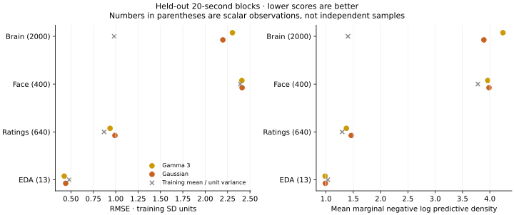
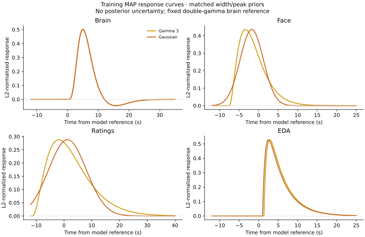

# Response comparison on the original movie clock

This comparison keeps the first 252 brain volumes at their original two-second
timestamps, trims the eight tail volumes, and treats `splices` as boundary
markers. Nonzero censor flags are still masked. This follows the clarified
preprocessing rule and the independent pause-marker evidence in the
[clock audit](2026-09-23-gp-clock-calibration.md).

<!-- RESULTS:START -->

**Preserving the movie clock does not resolve the predictive problem.** Both
selected fits pass convergence and independent numerical checks, but predict
brain, face, and ratings worse than the training-mean baseline on this fold.
EDA improves modestly, based on only 13 values. Five of the six starts meet
the convergence threshold; a higher-objective Gaussian start does not.

The [portable fit results](2026-09-23-gp-clock-preserved-results.json) include
every restart, response parameters, predictive scores, and numerical checks.
The [calibration results](2026-09-23-gp-clock-calibration-results.json) include
the clock audit, repeated innovation diagnostics, and fixed-parameter probes.

## Predictions and simple baselines

RMSE is in training-standard-deviation units; lower is better. Linear
interpolation uses only known training samples on either side of each gap.

| Modality | Scalars | Training mean | Linear interpolation | Gamma-3 | Gaussian |
| --- | ---: | ---: | ---: | ---: | ---: |
| Brain | 2,000 | 0.983 | 1.091 | 2.304 | 2.197 |
| Face | 400 | 2.393 | 2.380 | 2.410 | 2.412 |
| Ratings | 640 | 0.870 | 0.682 | 0.937 | 0.992 |
| EDA | 13 | 0.481 | 0.406 | 0.425 | 0.442 |

Mean marginal negative log predictive density also favors the training-mean/
unit-variance baseline for brain, face, and ratings. Conditional brain 95%
coverage is only 58.75% for gamma and 65.15% for Gaussian; ratings coverage is
92.50% and 87.97%. These intervals omit parameter uncertainty. Scalar counts
are not independent sample counts.



## Convergence and numerical qualification

| Family | Start | Objective | Projected gradient | Qualified | Iterations | Seconds |
| --- | ---: | ---: | ---: | --- | ---: | ---: |
| gamma3 | 0 | 74892.709137 | 0.000353 | Yes | 547 | 719.9 |
| gamma3 | 1 | 74832.810537 | 0.000593 | Yes | 436 | 553.8 |
| gamma3 | 2 | 74892.709137 | 0.000464 | Yes | 582 | 737.2 |
| gaussian | 0 | 74864.068522 | 0.0027 | No | 423 | 937.8 |
| gaussian | 1 | 74785.938815 | 0.00055 | Yes | 407 | 899.3 |
| gaussian | 2 | 74785.938815 | 0.000657 | Yes | 439 | 811.0 |

Both families select start 1 by the lowest training objective. Gaussian start 0
stops on relative objective change even after the existing retry; its physical
gradient remains above `1e-3`. The optimizer success flag does not qualify it.
It remains in the results rather than being hidden. Gaussian starts 1/2 reach
nearly identical lower objectives; the two higher gamma starts also agree.

| Selected family | Order-384 objective difference | Largest gradient difference |
| --- | ---: | ---: |
| gamma3 | 7.16e-06 | 7.45e-05 |
| gaussian | 7.11e-06 | 6.36e-05 |

Both selected points pass the declared gates. Independent grouped-quadrature
prediction checks cover five feature/modality combinations per family, including
both endpoint brain parcels and all four modalities in the first subject.
Maximum mean differences are below `3.9e-8`, and variance differences below
`1.9e-9`. These checks support the reported poor predictions rather than a
discrepancy in the state-space prediction calculation at these fitted points.

## Response constraints and training residuals

Both families still hit the face FWHM upper bound of seven seconds, rating
FWHM upper bound of sixteen seconds, and EDA decay upper bound of four seconds.
EDA onset is now interior. The face/rating peaks differ substantially from the
historical-clock estimates and between families. These constrained curves are
not precise physiological latency estimates.



Joint training-innovation whitening reproduces the production likelihood to
within `1.5e-10`. Substantial serial dependence remains after correcting the
clock. The cells below give median per-feature adjacent-sample correlations
within each subject (s001, then s002; EDA is available only for s001).

| Modality | Gamma-3 | Gaussian |
| --- | ---: | ---: |
| Brain | 0.541, 0.561 | 0.537, 0.558 |
| Face | 0.158, 0.195 | 0.209, 0.237 |
| Ratings | 0.927, 0.931 | 0.964, 0.952 |
| EDA | 0.784 | 0.740 |

These are descriptive diagnostics at fitted parameters, using the specified
simultaneous-observation whitening order and excluding pairs across missing
gaps. They identify remaining temporal structure without proving a unique cause.

<!-- PROBES:START -->

## Fixed-parameter calibration probes

These probes reuse the selected MAP parameters and examined holdout blocks.
They do not refit loadings, responses, or noise variances, and do not constitute
new converged models or independent model-selection evidence.

| Diagnostic | Brain gamma | Brain Gaussian | Ratings gamma | Ratings Gaussian |
| --- | ---: | ---: | ---: | ---: |
| Original, GP timescale 3 s | 2.304 | 2.197 | 0.937 | 0.992 |
| GP timescale 10 s | 2.078 | 1.938 | 0.937 | 0.992 |
| GP timescale 30 s | 1.549 | 1.403 | 0.939 | 0.992 |
| Brain-only conditioning | 1.563 | 1.492 | 0.952 | 0.999 |
| OU noise, shared mean only | 1.886 | 1.922 | 0.937 | 0.983 |
| OU noise, total observation mean | 1.876 | 1.914 | 0.655 | 0.704 |

Longer latent timescales and brain-only conditioning reduce the brain error
without reaching the 0.983 training-mean baseline. The brain-only case still
uses parameters fitted jointly with all modalities. Increasing the timescale
alone barely changes rating errors.

The private OU residual timescales are fixed at 3/1.5/15/5 seconds for
brain/face/ratings/EDA, using the same rounded training-diagnostic choices as the
earlier probe. Rating observation RMSE improves to 0.655/0.704, but shared-only
RMSE stays at 0.937/0.983. Most of the improvement comes from private residual
interpolation. The 0.682 linear-interpolation baseline gives useful context.
Brain predictions improve but remain poor, face changes are small, and EDA
shows no consistent benefit.

The OU prediction API spot-checks agree within `5.6e-10`. Refining quadrature
from order 384 to 768 changes the full shared/private/total prediction vectors
by at most `5.8e-08`, passing the unchanged `1e-4` gate. These checks qualify
the fixed-point calculation; predictive interval calibration for a refitted
OU model has not been evaluated.

## Next experiment

The [subsequent 36-start refit study](2026-09-23-gp-temporal-refits.md)
completes the timescale/noise comparison described here and scores all three
block schedules. It reserves their union from every new fit; those additional
blocks were used in earlier training, so they are not an untouched test cohort.
The paragraphs below record the motivation for that experiment.

Refit the response/loadings/noise parameters with correlated residuals across
a small, predeclared set of fixed latent GP timescales, selecting within that
set using training data. The existing API rejects joint GP-timescale learning
with correlated noise; continuous joint learning would need an independently
qualified extension. Keep reporting shared-signal and total-observation
predictions separately.

Also check sensitivity to post-splice contamination and response history at
segment boundaries. These data include pauses, so preserving movie timestamps
does not by itself validate an uninterrupted physiological response history.
Once the preprocessing and model choices are settled, evaluate the prepared
additional blocked schedules before drawing response-family conclusions or starting a large
NUTS/Gibbs/VI comparison.

<!-- PROBES:END -->

<!-- RESULTS:END -->

## Protocol and scope

The two families share 58,971 training scalars at 948 observation nodes and
3,053 held-out scalars, using subjects s001/s002, three latent factors, and all
100 brain parcels. Brain uses fixed DoubleGamma; EDA uses learned BatemanSCR;
face and ratings use either gamma shape 3 or Gaussian responses. Pulse and
respiration are excluded. The latent Matérn-3/2 timescale stays fixed at three
seconds. There are 1,106 parameters, with 78 states for gamma and 180 for Gaussian.

The analysis window is 0–500 seconds. The original missing-block schedule is
unchanged: brain 220–240 seconds, face 260–280, ratings 300–320, and EDA 340–360,
with half-open intervals. Eligible training rows have common response support.
Standardization uses training observations only; held-out payload perturbation
and affine-invariance checks pass. Values for the unchanged brain rows agree
with the historical values after accounting for affine standardization, to
`3.2e-15`. Other modality values, masks, and timestamps are identical.

The [loader adapter](../../scripts/clock_preserving_emo_data.py) reconstructs raw
brain parcel means, uses a separate provenance-checked cache, and delegates
other streams to the historical local loader. It restores seven uncensored
splice rows in s001 and eight in s002 before window/support selection. The
first 252 volumes span 0–502 seconds. Full acquisition timing has not been
independently reconstructed beyond the pause-marker check and clarified
preprocessing rule.

Compared with the [historical larger comparison](2026-09-23-gp-expanded-response-fits.md),
the clock, selected brain rows, and training standardization change. Consequently,
the old and new brain scores are not errors on identical observations with an
isolated model change. Raw objectives across these datasets are not comparable.
Within this new comparison, both response families have identical data hashes.

Each family runs the unchanged three-start design with seed 722. Starts use
the existing 1,000-iteration L-BFGS-B limit and 400-iteration retry, with log-noise
optimizer coordinates and convergence judged using a physical projected gradient
of at most `1e-3`. All starts must finish before selecting by training objective;
held-out predictions are not involved in restart selection. A lower unqualified
endpoint is reported rather than replaced by a higher qualified endpoint.

The selected point must pass independent response-quadrature checks: objective
difference at most `1e-3` and largest gradient difference at most `1e-4`.
Quadrature starts at order 384 and is refined if necessary; the gates are not
relaxed. Independent grouped-quadrature prediction spot-checks have a `1e-4`
absolute gate for means and variances. This is local numerical qualification,
not a global optimum or full-parameter-box accuracy claim.

The gamma workers use separate eight-core CPU allocations. Gaussian starts 0/1
share the RTX PRO 6000, and start 2 uses the RTX 3090. All use float64 and one
BLAS/OMP thread. Subsequent scoring and numerical checks run on CPU. Overlapping
fit times are operational measurements, not a
controlled family or device speedup comparison.

## Reproduction

Run each start separately, selecting the appropriate device environment:

```sh
PYTHONPATH=src JAX_ENABLE_X64=true OPENBLAS_NUM_THREADS=1 OMP_NUM_THREADS=1 \
  python scripts/compare_gp_response_families.py --candidate gamma3 \
  --features 3 --parcels 100 --fold original --starts 3 --start-index 0 \
  --loader scripts/clock_preserving_emo_data.py --fit-only \
  --output local_data/gp-response-movie-clock-2026-09-23/gamma3-start0.json

python scripts/collect_gp_response_starts.py \
  local_data/gp-response-movie-clock-2026-09-23/gamma3-start[012].json \
  --output local_data/gp-response-movie-clock-2026-09-23/gamma3-k3.json
```

Repeat for Gaussian and use the same loader, candidate, features, parcels, fold,
and collected output path for `--action validate --order 384` and `--action score`.
The collector checks matching loader hashes as well as observation hashes.
The summary exporter checks fitted-point gates before writing portable metrics.
Run `check_gp_empirical_predictions.py` with `--algebra grouped --first-subject-only`
and run `diagnose_gp_response_calibration.py` on each selected fit. These runners
restore the saved loader setting. Empirical data and the historical local loader
are required; raw observations, loadings, checkpoints, and prediction arrays stay
in ignored local storage.

This remains missing-block smoothing with other modalities available. Conditional
MAP intervals omit parameter and preprocessing uncertainty. There are only two
subjects, one examined fold, and 13 EDA held-out values from one subject. The two
additional prepared schedules remain unrun and should be reserved for a settled
model and preprocessing specification.
