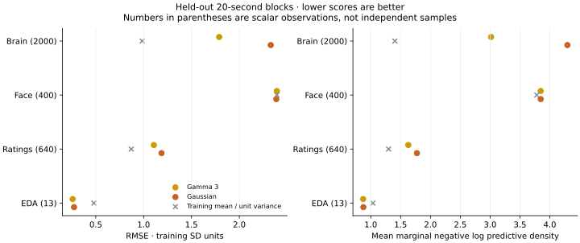
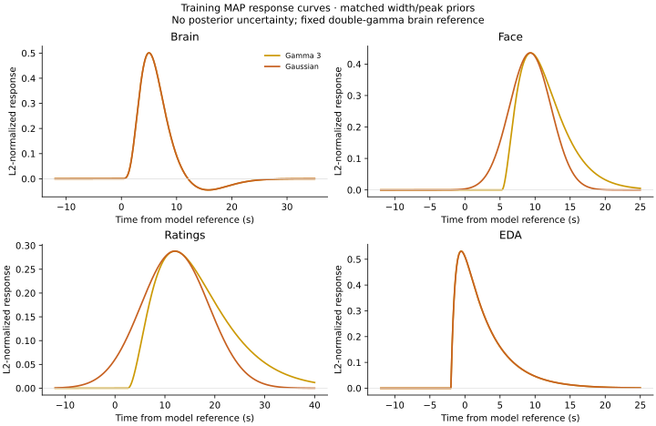

# Three-factor, full-parcellation response comparison

**All six MAP fits converge, but the larger models still predict brain and
ratings worse than the training-mean baseline on this fold.** Gamma improves
over Gaussian on those two modalities, while face predictions barely improve
over the baseline. EDA improves for both families, based on only 13 held-out
values. These results favor investigating model calibration before more folds
or expensive posterior sampling; they do not establish a general response-family
winner.

This extends the [small held-out comparison](2026-09-22-gp-response-holdout.md)
to three latent factors and 100 brain parcels using the existing production
sequential filter. The six fits compare gamma-3 versus Gaussian face/rating
responses, with three initializations per family. Brain uses fixed DoubleGamma
and EDA uses learned BatemanSCR. Pulse and respiration are excluded.

The [aggregate results](2026-09-23-gp-expanded-response-results.json) contain
individual convergence records, device/timing information, numerical checks,
response parameters, and predictive metrics. Production inference is unchanged.

## Prediction results

RMSE is in training-standard-deviation units. Lower is better.

<!-- RMSE:START -->

| Modality | Held-out scalars | Baseline | Gamma-3 | Gaussian |
| --- | ---: | ---: | ---: | ---: |
| Brain | 2,000 | 0.985 | 1.789 | 2.328 |
| Face | 400 | 2.393 | 2.393 | 2.386 |
| Ratings | 640 | 0.870 | 1.107 | 1.187 |
| EDA | 13 | 0.481 | 0.258 | 0.273 |

<!-- RMSE:END -->

Mean marginal negative log predictive density, including observation noise,
also favors the baseline for brain, face, and ratings:

<!-- NLPD:START -->

| Modality | Held-out scalars | Baseline | Gamma-3 | Gaussian |
| --- | ---: | ---: | ---: | ---: |
| Brain | 2,000 | 1.404 | 3.015 | 4.294 |
| Face | 400 | 3.781 | 3.847 | 3.846 |
| Ratings | 640 | 1.298 | 1.628 | 1.773 |
| EDA | 13 | 1.035 | 0.872 | 0.875 |

<!-- NLPD:END -->

Conditional 95% intervals cover only 62.75% of held-out brain observations for
gamma and 48.30% for Gaussian. Ratings coverage is 88.59% and 85.63%, respectively.
These intervals condition on MAP parameters and training standardization;
they omit parameter uncertainty. The samples within each held-out block are
correlated, and the EDA result is particularly small. Macro averages should
not obscure the large differences between modalities.



## Convergence and numerical agreement

<!-- STARTS:START -->

| Family | Start | Training objective | Projected gradient | Iterations | Optimization seconds |
| --- | ---: | ---: | ---: | ---: | ---: |
| gamma3 | 0 | 73240.862161 | 0.000982 | 401 | 490.4 |
| gamma3 | 1 | 73315.198206 | 0.00016 | 539 | 696.4 |
| gamma3 | 2 | 73238.401127 | 0.000382 | 359 | 466.6 |
| gaussian | 0 | 73325.975517 | 0.0005 | 350 | 792.4 |
| gaussian | 1 | 73227.124629 | 0.00016 | 424 | 857.3 |
| gaussian | 2 | 73227.124629 | 0.00028 | 389 | 703.1 |

<!-- STARTS:END -->

Every endpoint meets the physical projected-gradient threshold `1e-3`.
Gamma selects start 2; Gaussian selects start 1. Gaussian starts 1 and 2
reach nearly identical objectives, but start 0 remains in a higher basin.
Gamma has three distinct endpoints. Convergence is a local criterion, not
evidence that the global optimum has been found.

Both selected fits pass the predeclared independent order-384 quadrature
checks:

<!-- QUADRATURE:START -->

| Family | Objective difference | Largest gradient difference | Gate |
| --- | ---: | ---: | --- |
| gamma3 | 1.4e-05 | 4.03e-05 | Pass |
| gaussian | 6.09e-06 | 5.5e-05 | Pass |

<!-- QUADRATURE:END -->

The empirical scoring spot-check compares nine subject/modality/feature
combinations with the existing production prediction API. The largest
mean/variance discrepancy is `1.62e-13`. This checks the batched scorer;
it does not independently validate the shared state-space prediction backend.
The [prediction-check runner](../../scripts/check_gp_empirical_predictions.py)
also supports independent grouped response quadrature.

<!-- PREDICTION:START -->

The independent grouped-quadrature checks cover five feature/modality
combinations per family in the first subject, including both endpoint brain
parcels and all four modalities. Maximum mean discrepancies are below `4.1e-8`
for gamma and `2.0e-8` for Gaussian; variance discrepancies are below
`2.9e-9` and `8.2e-10`. Both pass the `1e-4` absolute prediction gate by a
large margin. These spot-checks support the reported poor predictions rather
than a discrepancy in the state-space smoother at these fitted points.

<!-- PREDICTION:END -->

## Response constraints remain active

Both families reach the face FWHM upper bound of 7 seconds, rating FWHM upper
bound of 16 seconds, rating peak upper bound of 12 seconds, EDA decay upper
bound of 4 seconds, and EDA onset lower bound of -2 seconds. Face peaks are
approximately 9.38 seconds for gamma and 9.30 seconds for Gaussian.



These are constrained MAP curves, not precise physiological estimates. Their
similar widths/peaks partly reflect the imposed bounds. This larger experiment
also changes the brain parcellation as well as factor count, so differences
from the earlier one-factor study cannot be attributed solely to more factors.
Raw training objectives should not be compared across the two datasets.

## Protocol declared before fitting

The two-subject, 500-second original fold has 57,671 training observations at
942 nodes and 3,053 held-out observations. Both candidates use identical
training rows, preprocessing, physical FWHM/peak priors, bounds, and seed 722.
There are 1,106 parameters; gamma has 78 states and Gaussian has 180. The latent
GP timescale remains fixed at three seconds. This remains missing-block
smoothing with other modalities available, not forecasting or prediction for
new subjects.

Each start uses the same L-BFGS-B settings as the smaller comparison: at most
1,000 initial iterations, followed by the existing 400-iteration retry if the
physical projected gradient exceeds `1e-3`. Independent workers select a single
index from the unchanged three-start design. They save parameter checkpoints
every 50 iterations and do not evaluate held-out predictions.

All three starts must finish before the lowest training objective selects a
fit within each family. Convergence is judged using the physical projected
gradient, not the optimizer success flag. A lower but unqualified endpoint is
reported as unresolved rather than silently discarded in favor of a higher
qualified solution. Predictions condition on the selected MAP and retain all
cross-factor covariance terms.

Before interpreting the scores, compare the selected objective and gradient
with independent order-384 response quadrature. The declared fitted-point
gates are objective difference `<= 1e-3` and largest gradient difference
`<= 1e-4`; the latter is one tenth of the MAP convergence threshold. If the
quadrature itself is insufficient, report refinement rather than relaxing the
gate. Scores include per-modality RMSE, marginal negative log predictive
density, and conditional 95% coverage, with the training-mean/unit-variance
baseline retained. EDA has only 13 held-out values from one subject.

The gamma starts run on separate eight-core CPU allocations. Gaussian starts
0 and 1 share the RTX PRO 6000; start 2 uses the RTX 3090. Every worker uses
float64 and one BLAS/OMP thread. These overlapping fit durations are operational
measurements, not controlled CPU/GPU or response-family speedup ratios.

## Execution

The fit runner accepts `--start-index` and `--fit-only`, and writes checkpoints
atomically. After all starts finish,
[`collect_gp_response_starts.py`](../../scripts/collect_gp_response_starts.py)
checks their common protocol and selects solely by training objective. Scoring
and numerical validation then reuse the existing runner. Raw observations,
loadings, checkpoints, and predictions remain in ignored local storage.

For example, run each `i` in `0 1 2` with the appropriate device environment:

```sh
PYTHONPATH=src JAX_ENABLE_X64=true OPENBLAS_NUM_THREADS=1 OMP_NUM_THREADS=1 \
  python scripts/compare_gp_response_families.py --candidate gamma3 \
  --features 3 --parcels 100 --fold original --starts 3 --start-index 0 \
  --fit-only --output local_data/gp-response-expanded-2026-09-23/gamma3-start0.json

python scripts/collect_gp_response_starts.py \
  local_data/gp-response-expanded-2026-09-23/gamma3-start[012].json \
  --output local_data/gp-response-expanded-2026-09-23/gamma3-k3.json
```

Repeat for Gaussian. Use `--action validate --order 384`, followed by
`--action score`, with the same candidate, factor count, parcels, fold, and
collected output path. The summary exporter verifies the fitted-point gates
before writing the portable results and figures. It retains each worker's
provenance and correctly records three factors rather than the earlier
one-factor scope.

For the independent prediction check, pass the collected/scored fit to
`scripts/check_gp_empirical_predictions.py --algebra grouped --first-subject-only`
with an `--output` path under `local_data`. Without `--algebra grouped`, the
runner compares with the production state-space per-feature API.

## What this changes about the next step

The immediate scientific question is why the fitted model gives poor
predictions and narrow brain uncertainty across missing blocks. Check the
reconstruction across those blocks, cross-modal timing, and the consequences
of the fixed three-second latent timescale and independent observation-noise
model. These are hypotheses to test, not diagnosed causes. Any subsequent
bound or model changes need explicit validation; this fold has already been
examined and is not a fresh test set.

The two additional prepared folds remain unrun. Computational work can still
target the measured Gaussian costs, but these results do not justify choosing
a response family from runtime alone or launching a large NUTS/Gibbs/VI
comparison before resolving the predictive problem.
