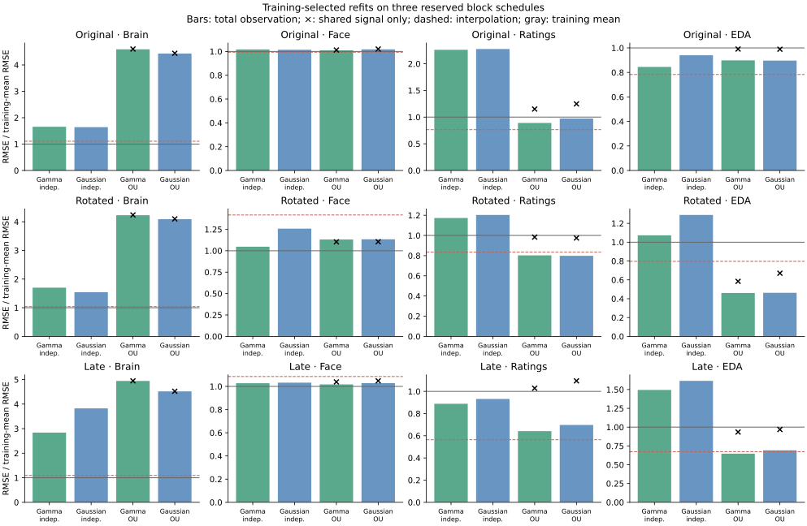

# Temporal-noise refits and NVIDIA performance

This experiment refits the response, loading, offset, and noise-variance
parameters while profiling fixed latent GP timescales of 3, 10, and 30 seconds.
It compares gamma shape 3 and Gaussian face/rating responses, each with
independent or fixed-timescale OU residual noise. Brain retains fixed DoubleGamma
responses; EDA retains learned BatemanSCR responses. Pulse and respiration are
excluded. No production inference defaults change.

**There is a useful NVIDIA speedup, but the noise refits do not solve the
predictive problem.** Keeping Gaussian responses and switching from state-space
to grouped quadrature makes the matched RTX 3090 gradient 3.32 times faster.
A separate complete gamma/OU MAP fit takes 40.0 minutes on the tested CPU
configuration, 3.6 minutes on the RTX PRO 6000, and 5.4 minutes on the RTX 3090,
reaching the same objective. These are research measurements, not a new
automatic backend policy or a converged posterior-sampling comparison.

All 36 starts finish; 28 satisfy the convergence gate. Training-only selection
chooses the three-second GP timescale for all four family/noise combinations,
and all four selected fits qualify. Two nonselected 30-second profiles have
unqualified lowest-objective points; those failures remain visible below.
All twelve reported points pass the higher-order numerical check, which is
separate from optimizer convergence.

Across the three reserved schedules, every model loses to the training-mean
baseline for brain and face. Brain RMSE ranges from 1.47–3.97 with independent
noise and 3.89–5.13 with OU noise, versus baselines of 0.95–1.04. OU noise
improves total rating predictions substantially, but beats linear interpolation
only on the rotated schedule. Most of the rating benefit comes from the private
residual component; shared-only predictions remain weak. EDA improves on some
blocks, based on only 13–14 values per block from one subject. These results
do not establish a generally preferable response family or justify adopting
this OU-only residual model.

<!-- RESULTS:START -->

The [portable aggregate results](2026-09-23-gp-temporal-refit-results.json) contain every restart, all training profiles, selected response parameters, validation scores, and numerical gates.

## Training profiles

Each row reports the lowest objective among three completed starts. Timescales are selected within each family/noise cell; objectives are not independent predictive scores.

| Family | Noise | GP seconds | Training objective | Qualifying starts | Best qualifies | Selected |
| --- | --- | ---: | ---: | ---: | --- | --- |
| gamma3 | independent | 3 | 66723.635 | 3/3 | Yes | Yes |
| gamma3 | independent | 10 | 67158.918 | 1/3 | Yes |  |
| gamma3 | independent | 30 | 67800.718 | 2/3 | Yes |  |
| gamma3 | ou | 3 | 51200.809 | 3/3 | Yes | Yes |
| gamma3 | ou | 10 | 52326.737 | 2/3 | Yes |  |
| gamma3 | ou | 30 | 53564.290 | 2/3 | No |  |
| gaussian | independent | 3 | 66738.677 | 3/3 | Yes | Yes |
| gaussian | independent | 10 | 67202.996 | 3/3 | Yes |  |
| gaussian | independent | 30 | 67852.217 | 3/3 | Yes |  |
| gaussian | ou | 3 | 51182.908 | 3/3 | Yes | Yes |
| gaussian | ou | 10 | 52318.525 | 3/3 | Yes |  |
| gaussian | ou | 30 | 53553.207 | 0/3 | No |  |

## Selected response estimates

All quantities are seconds. These are constrained MAP response shapes, conditional on the noise specification and this training mask; they are not precise physiological latency estimates.

| Model | Face FWHM | Face peak | Rating FWHM | Rating peak | EDA decay | EDA peak |
| --- | ---: | ---: | ---: | ---: | ---: | ---: |
| Gamma / independent | 7.000 | 9.901 | 16.000 | -3.208 | 4.000 | 1.668 |
| Gamma / OU | 6.198 | 6.350 | 13.606 | 12.000 | 2.519 | 0.814 |
| Gaussian / independent | 7.000 | 8.237 | 16.000 | -2.212 | 4.000 | 1.420 |
| Gaussian / OU | 7.000 | 7.711 | 13.199 | 12.000 | 2.521 | 0.802 |

## Original block validation

RMSE in the common training-standard-deviation units; lower is better.

| Prediction | Brain | Face | Ratings | EDA |
| --- | ---: | ---: | ---: | ---: |
| Training mean | 0.983 | 2.283 | 0.878 | 0.495 |
| Linear interpolation | 1.090 | 2.268 | 0.672 | 0.388 |
| Gamma / independent | 1.628 | 2.322 | 1.985 | 0.418 |
| Gamma / OU | 4.514 | 2.305 | 0.782 | 0.445 |
| Gamma / OU, shared only | 4.524 | 2.311 | 1.010 | 0.491 |
| Gaussian / independent | 1.614 | 2.315 | 1.998 | 0.466 |
| Gaussian / OU | 4.355 | 2.323 | 0.854 | 0.444 |
| Gaussian / OU, shared only | 4.365 | 2.329 | 1.096 | 0.490 |

## Rotated block validation

RMSE in the common training-standard-deviation units; lower is better.

| Prediction | Brain | Face | Ratings | EDA |
| --- | ---: | ---: | ---: | ---: |
| Training mean | 0.952 | 0.849 | 1.094 | 0.426 |
| Linear interpolation | 0.989 | 1.204 | 0.913 | 0.339 |
| Gamma / independent | 1.618 | 0.889 | 1.283 | 0.457 |
| Gamma / OU | 4.025 | 0.960 | 0.878 | 0.196 |
| Gamma / OU, shared only | 4.034 | 0.937 | 1.076 | 0.249 |
| Gaussian / independent | 1.467 | 1.068 | 1.316 | 0.549 |
| Gaussian / OU | 3.893 | 0.962 | 0.873 | 0.197 |
| Gaussian / OU, shared only | 3.902 | 0.938 | 1.066 | 0.285 |

## Late block validation

RMSE in the common training-standard-deviation units; lower is better.

| Prediction | Brain | Face | Ratings | EDA |
| --- | ---: | ---: | ---: | ---: |
| Training mean | 1.038 | 0.779 | 1.165 | 0.462 |
| Linear interpolation | 1.135 | 0.845 | 0.657 | 0.311 |
| Gamma / independent | 2.948 | 0.800 | 1.035 | 0.691 |
| Gamma / OU | 5.132 | 0.792 | 0.748 | 0.299 |
| Gamma / OU, shared only | 5.135 | 0.809 | 1.198 | 0.432 |
| Gaussian / independent | 3.972 | 0.804 | 1.086 | 0.747 |
| Gaussian / OU | 4.691 | 0.801 | 0.812 | 0.320 |
| Gaussian / OU, shared only | 4.695 | 0.816 | 1.276 | 0.448 |



## Matched NVIDIA benchmark

All devices evaluate the same float64 gamma/OU point: 52,964 scalar observations, 841 functional nodes, three factors, and quadrature order 384. Three warm repetitions follow the first compilation-inclusive call.

| Device | First gradient (s) | Median warm gradient (s) | Warm CPU ratio |
| --- | ---: | ---: | ---: |
| cpu (8-core affinity, BLAS 1) | 15.06 | 5.993 | 1.00× |
| cpu (8-core affinity, BLAS 8) | 14.92 | 5.887 | 1.02× |
| NVIDIA GeForce RTX 3090 | 23.89 | 0.751 | 7.98× |
| NVIDIA RTX PRO 6000 Blackwell Workstation Edition | 43.03 | 0.434 | 13.80× |

On the RTX 3090, increasing from three to six latent factors raises the grouped matrix dimension from 2,523 to 5,046 and the median warm gradient cost from 0.751 to 3.200 seconds (4.26×). The data and observed feature count are unchanged. The six-factor probe passes three directional derivative checks, but is not a converged fit or a predictive accuracy qualification.

At identical initial physical coordinates on the RTX 3090, the median grouped gradient takes 0.751 seconds for gamma and 0.735 seconds for Gaussian responses. This fixed-order grouped calculation shows little timing benefit from changing the response family itself; it is a different cost comparison from the earlier state-space filter-bank studies.

Holding the Gaussian independent-noise model fixed on the RTX 3090, the production state-space gradient takes 1.542 seconds versus 0.464 seconds for grouped quadrature (**3.32×**). At this same physical point, objectives differ by 7.6e-07 and gradients by at most 2.4e-06, passing the declared gates. This qualifies the measured initial point; it is not a blanket backend ranking for longer recordings or other factor counts.

The separate single-start fit benchmark uses the same seeded initial point, data, priors, bounds, optimizer settings, and convergence gate. Pipeline time includes data/model preparation, compilation, timing and derivative checks, and complete optimization, measured after Python imports.
Each fit process has eight-core CPU affinity and single-thread BLAS/OMP settings. The separate eight-thread BLAS probe changes the median warm CPU cost only slightly; this comparison does not claim the fastest possible CPU configuration.

| Device | Pipeline (s) | Optimization (s) | Iterations | Objective | Projected gradient |
| --- | ---: | ---: | ---: | ---: | ---: |
| cpu | 2398.6 | 2316.0 | 346 | 51217.052366 | 0.00016 |
| NVIDIA RTX PRO 6000 Blackwell Workstation Edition | 216.8 | 164.4 | 344 | 51217.052366 | 0.000393 |
| NVIDIA GeForce RTX 3090 | 325.6 | 287.7 | 347 | 51217.052366 | 0.000185 |

The measured complete-fit CPU/GPU time ratio is **11.06× on the RTX PRO 6000** and **7.37× on the RTX 3090** for this model and workload. It does not establish a NUTS, Gibbs, or variational-inference speedup, or complete-fit scaling to higher factor counts.

<!-- RESULTS:END -->

## Numerical checks, calibration, and splice flags

All twelve best reached points agree with order-768 quadrature within
`3.5e-5` in objective and `7.3e-5` in the largest gradient component. The four
selected models' complete prediction vectors and variances change by at most
`1.3e-7` between orders 384 and 768, below the unchanged `1e-4` gate. Twenty
production prediction spot-checks agree within `3.0e-9`. Thirty fixture
comparisons with dense conditioning agree within `5.9e-13` in means and
`7.6e-14` in variances, including mixed feature keys and duplicate query times.
The poor brain predictions therefore persist in numerically qualified results.

Conditional brain 95% interval coverage is 39–77% with independent noise and
39–68% with OU noise across these cases. Brain marginal predictive density
also loses to the unit-normal baseline on every schedule. Rating intervals
under OU noise cover about 81–89%; parameter uncertainty is not included.
Changing residual assumptions shifts rating peaks from approximately −3/−2
seconds to the +12-second upper bound. EDA decay becomes interior, while the
Gaussian face width remains at its upper bound. Response interpretation is
still sensitive to the model specification.

The original and rotated brain targets contain no supplied post-splice flags.
The late block contains 600 flagged scalars and 1,300 unflagged scalars.

| Late brain targets | Gamma / independent | Gaussian / independent | Gamma / OU | Gaussian / OU | Training mean |
| --- | ---: | ---: | ---: | ---: | ---: |
| Flagged | 1.896 | 2.480 | 7.547 | 6.132 | 1.099 |
| Unflagged | 3.323 | 4.497 | 3.493 | 3.849 | 1.009 |

Difficulties are not confined to flagged targets. This does not rule out an
effect of contaminated training observations or incorrectly modeled response
history through pauses; neither was refitted in this stratified check.

## What this supports next

Use the qualified grouped GPU calculation as a computational baseline for this
workload; select response families for predictive and physiological reasons.
For prediction, the research scorer already reuses the grouped factorization
and native-time covariance across features. The production OU prediction path
still evaluates shared covariance at repeated observation rows and refactors
for individual features. Moving that reuse into the production API is a
concrete optimization to benchmark and validate separately.

The subsequent [production prediction study](2026-09-23-gp-grouped-prediction.md)
implements that reuse and measures its effect without changing the fitted
models or response/noise specification reported here.

For the model, test private temporal variation alongside an independent
measurement-noise component, rather than replacing all measurement noise with
OU covariance. That is a hypothesis to evaluate, not a demonstrated fix.
Check shared/private signal identifiability and response history at segment
joins before a large NUTS/Gibbs/VI campaign. Longer GP timescales did not win
the present training profile, and the six-factor timing probe shows that
increasing latent dimension also has a substantial cost. A separate validation
cohort remains necessary after choosing the specification.

## Protocol fixed before scoring

All twelve configurations use three seeded starts (seed 722), three factors,
100 brain parcels, subjects s001/s002, and the 0–500-second window. They share
52,964 training scalars at 841 observation nodes, with the clarified
[first-252-volume movie clock](2026-09-23-gp-clock-preserved-fits.md).

All three block schedules are removed from every new fit and from the
standardization statistics. For each response-family/noise combination, the
lowest training MAP objective across the three timescales and all three starts
selects one fit. All starts must finish before selection. The selected fit must
meet the physical projected-gradient threshold of `1e-3`; its objective and
gradient must also agree with order-768 grouped quadrature within `1e-3` and
`1e-4`, respectively. Optimizer success alone does not qualify convergence.
Selection is locked before scoring any of the four chosen models.

| Schedule | Brain | Face | Ratings | EDA |
| --- | --- | --- | --- | --- |
| Original | [220, 240) | [260, 280) | [300, 320) | [340, 360) |
| Rotated | [260, 280) | [300, 320) | [340, 360) | [220, 240) |
| Late | [300, 320) | [340, 360) | [380, 400) | [260, 280) |

The common training mask excludes the union of these intervals. Some gaps
therefore overlap across modalities: at 260–280 seconds only ratings remain,
and at 300–320 seconds only s001's EDA remains. These are three score schedules
for one fitted training set, not three separately refitted cross-validation
folds. The conditioning information and training standardization differ from
the earlier single-schedule fits, so comparisons with those older RMSE values
are not matched performance gains. All four newly selected models and their
baselines use the same observations and units within this experiment.

These are additional blocked validations within the same small cohort. The
rotated/late blocks were included in earlier exploratory training fits, and
the OU timescales were informed by those earlier training diagnostics. Excluding
all three schedules from this round improves separation within the experiment;
it does not create an independent, previously untouched test cohort.

The private OU timescales remain fixed at 3/1.5/15/5 seconds for
brain/face/ratings/EDA. Continuous joint learning of the GP timescale and
correlated noise is not supported by the current API. Training-objective
profiling over these discrete settings is not marginal-likelihood model evidence.

Scores distinguish shared-signal means from total observation means, because
private residual interpolation can improve predictions without improving the
shared representation. RMSE is compared with the training mean and interpolation
using training values only. Marginal predictive density and 95% coverage are
conditional on MAP parameters and omit parameter uncertainty. Numerical checks
compare full prediction vectors and variances at quadrature orders 384 and 768,
with an absolute gate of `1e-4`, and spot-check the production prediction API.

Post-splice contamination is retained in the primary fits, following the
clarified clock protocol. Brain validation scores are also stratified by
the supplied contamination flags to check whether errors are confined to those
rows. This is a descriptive sensitivity check; it does not test a separately
refitted censoring policy or a physiological state reset at segment joins.

## Execution and reproducibility

The [refit runner](../../scripts/refit_gp_temporal_calibration.py) records the
training/validation hashes, all starts, physical gradients, source hashes,
derivative checks, and timings. The
[selection script](../../scripts/select_gp_temporal_calibration.py) locks
training-only choices, and the
[scorer](../../scripts/score_gp_temporal_calibration.py) reuses one grouped
factorization across feature/query batches. The
[fixture checks](../../scripts/check_gp_temporal_calibration.py) compare this
cache with dense Gaussian conditioning, including white and OU noise, feature
masks, zero loadings, and interpolation at observed times.

Raw observations, fitted loadings, private prediction vectors, and checkpoints
remain under ignored `local_data/gp-temporal-refit-2026-09-23`. The CPU Gaussian
state-space trial was stopped after the matched-point grouped GPU calculation
passed the objective/gradient gates. Its partial checkpoint is retained locally;
the scored Gaussian controls restart from the original seeded points on grouped
GPU algebra. Gamma independent-noise fits use the state-space CPU calculation.
OU fits use grouped GPU algebra. All calculations use float64.

The runtime is Python 3.12.13 with JAX 0.11.2. The host has an AMD Ryzen
Threadripper PRO 3995WX (64 physical cores); CPU timings restrict each process
to eight distinct physical cores. These measurements compare the recorded
configurations, not every possible CPU or GPU tuning choice.

The initial CPU/RTX 3090/RTX PRO 6000 comparison uses an identical gamma/OU
point and eight pinned CPU cores per process. Three warm evaluations follow
one compilation-inclusive evaluation. The matched single-start reference
refits use the same gamma/OU start 0; the main experiment selects start 2 for
that family/noise cell. Complete-fit timings include compilation and checks,
separately from warm gradient timings. Grid workers overlap; their times are
not isolated device benchmarks. The GPU reference fits and final Gaussian
backend probes have exclusive use of their respective GPU; other CPU work
can overlap. Different families assigned to different devices do not establish
a family speed ranking; the explicit matched RTX 3090 probes address that
comparison separately.

The [aggregate exporter](../../scripts/summarize_gp_temporal_calibration.py)
requires every fit, locked selection, completed score set, prediction refinement,
and matched reference benchmark before writing public results. It exports
shared response shapes, scores, timings, and checks, without participant
loadings or observation/prediction vectors. Reproduction requires the separately
available empirical files and historical local loader.

For example, in the configured Bayesian/CUDA research environment:

```sh
JAX_ENABLE_X64=true JAX_PLATFORMS=cuda XLA_PYTHON_CLIENT_PREALLOCATE=false \
  python scripts/refit_gp_temporal_calibration.py \
  --action fit --candidate gaussian --noise independent --length-scale 3 \
  --algebra grouped \
  --output local_data/gp-temporal-refit-2026-09-23/gaussian-independent-3.json
```

Repeat the candidate/noise/timescale grid with the same data settings, using
`--algebra grouped` for the Gaussian independent-noise controls. Reinvoke each
configuration with `--action validate` before locking selection with
`select_gp_temporal_calibration.py DIRECTORY --output DIRECTORY/selection.json`.
Score each selected fit at orders 384 and 768 with
`score_gp_temporal_calibration.py FIT --selection SELECTION --order ORDER
--output OUTPUT`; the 768 refinement uses `--skip-api-check`. The exact
environment, source hashes, settings, and gates are recorded in the artifacts.
