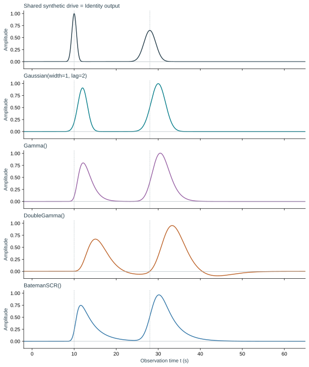
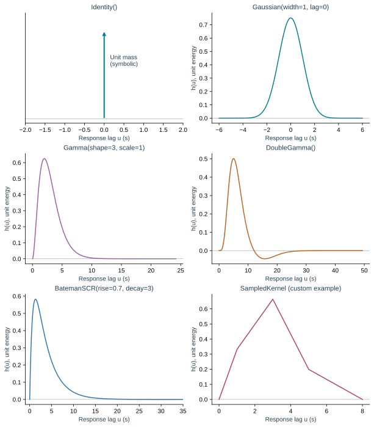
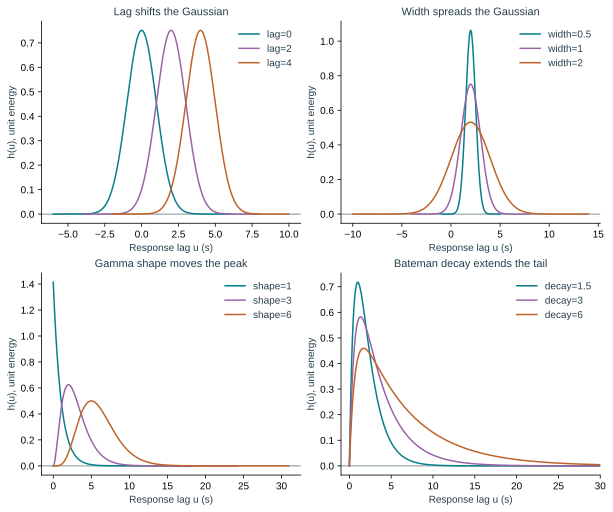
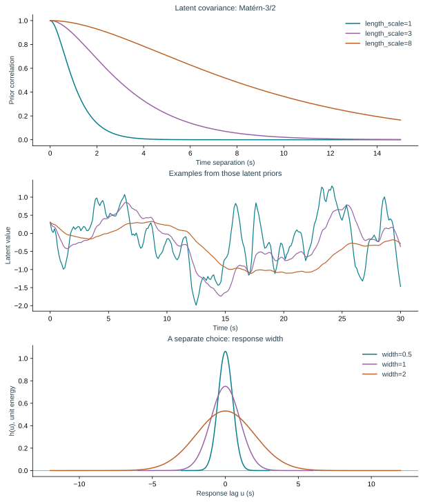
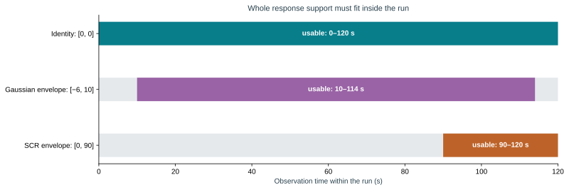

# Temporal kernels, visually

Two different objects are sometimes called a *temporal kernel*. The **response filter** describes how a modality smooths, delays or reshapes the shared signal. The **GP covariance** describes how latent values at two times vary together before observing data. Changing one is not equivalent to changing the other.

## Follow one signal through a response

For a latent factor $z(t)$ and response $h(u)$, the filtered signal is

$$
y(t) = (h*z)(t) = \int h(u)\,z(t-u)\,du.
$$

The horizontal axis of $h$ is **response lag** $u$, not observation time. Positive lag uses an earlier latent value and moves the observed response later. A symmetric Gaussian is two-sided; causal families have no response before their shifted onset. They are causal relative to the model origin only when their onset lag is nonnegative.

[](assets/figures/kernel-convolution.svg)

**Read from top to bottom:** every row filters the same synthetic drive. Dotted lines mark its two event centers. Smooth, delayed peaks and an undershoot arise from the chosen response. Curves use the implementation's L2 normalization and a common vertical scale; their amplitudes are not unit-area averages. These are illustrations, not fitted data or recovery results.

## Available response families

These are the response families used for new examples. `BachSCR` is moving to historical-only support; see [legacy Bach analyses](#legacy-bach-analyses) and the [queued removal](upcoming-changes.md).

[](assets/figures/kernel-families.svg)

Each panel shows the stated constructor. The Bateman panel shows the first 35 seconds of its 90-second support so the rise is visible. Identity is drawn as a symbolic unit impulse: it has no finite sampled height.

| Family | Parameters and defaults | Shape and support | Useful interpretation |
| --- | --- | --- | --- |
| `Identity()` | None | Analytic unit-mass impulse at zero | No response smoothing or delay |
| `Gaussian()` | `width=1.0`, `lag=0.0` | Symmetric bell, support `lag ± 6*width` | Smooth measurement response with a center lag; two-sided, generally noncausal |
| `Gamma()` | `shape=3.0`, `scale=1.0`, `lag=0.0` | One-sided positive rise and decay; upper tail cut at survival probability $10^{-8}$ | A response whose peak occurs after onset |
| `DoubleGamma()` | `peak_shape=6.0`, `peak_scale=1.0`, `undershoot_shape=16.0`, `undershoot_scale=1.0`, `undershoot_ratio=1/6`, `lag=0.0` | Positive gamma minus a later gamma; both tails cut at $10^{-8}$ | HRF-like shape with an undershoot, not an automatically validated HRF |
| `BatemanSCR()` | `rise=0.7`, `decay=3.0`, `lag=0.0` | Two exponential stages, 90 seconds after lag | Flexible SCR alternative; time constants can be learned where supported |
| `SampledKernel(lags, values)` | Explicit increasing lags and matching finite nonzero values | Piecewise-linear interpolation, zero outside supplied support | A fixed externally specified response; not learned FIR estimation |

Times, widths, scales and time constants use the timestamp unit, normally seconds. Gamma shapes and the undershoot ratio are dimensionless. Bateman's `rise` and `decay` are time constants (seconds), not decay rates.

### What the formulas mean

For each non-Identity family, let $q(u)$ be the raw curve on its finite support $[a,b]$. The implementation uses

$$
h(u) = \frac{q(u)}{\sqrt{\int_a^b q(v)^2\,dv}},
\qquad \int_a^b h(u)^2\,du=1.
$$

This is **unit energy**, not unit area or unit peak. Changing width can change the area under the curve and the output amplitude; the participant–modality loadings also set observation amplitude. Identity instead uses an analytic unit-mass impulse and cannot be evaluated as a sampled curve with `Identity().evaluate(...)`.

Write $s=u-\mathrm{lag}$ and let $g(s;\alpha,\beta)$ be the gamma density with shape $\alpha$ and scale $\beta$.

| Family | Raw shape before finite-support L2 normalization |
| --- | --- |
| Gaussian | $q(u)=\exp[-s^2/(2\,\mathrm{width}^2)]$ |
| Gamma | $q(u)=g(s;\mathrm{shape},\mathrm{scale})$, zero for $s<0$ |
| DoubleGamma | $q(u)=g(s;\alpha_p,\beta_p)-\rho g(s;\alpha_u,\beta_u)$ |
| BatemanSCR | $q(u)\propto(e^{-s/\mathrm{decay}}-e^{-s/\mathrm{rise}})/(\mathrm{decay}-\mathrm{rise})$ for $s\geq0$ |

For equal Bateman constants $\tau$, the last expression has the limit $s e^{-s/\tau}/\tau^2$; the implementation supports that limit. Exchanging `rise` and `decay` gives the same curve, so separated bounds are needed if those labels should be identifiable.

Gamma shapes must be at least one and positive scale parameters must exceed zero. DoubleGamma also requires the undershoot mean to follow the peak mean and its ratio to lie strictly between zero and one. `lag` is an **additional shift**: it is the Gaussian center but the onset for shifted causal responses. For a Gamma with shape greater than one, the peak is at `lag + (shape - 1)*scale`. Do not compare every family's `lag` as though it were its peak latency.

## Change one parameter at a time

[](assets/figures/kernel-parameters.svg)

The same lag sign convention applies across families. Width, shape and decay also affect apparent timing, so a single lag estimate is not the entire response.

## Fix, estimate or partially fix a response

A kernel constructor chooses a shape and its initial values. `Response` chooses which parameters the fit may change.

```python
from multimodalsrm import Gaussian, Response

# Fix the entire curve.
fixed = Response(Gaussian(width=1.0, lag=2.0),
                 estimate=False, pooling="shared")

# Learn only the lag, starting at 2 seconds.
lag_only = Response(
    Gaussian(width=1.0, lag=2.0), estimate=True, pooling="shared",
    fixed={"width": 1.0}, bounds={"lag": (0.0, 5.0)},
)

# Learn width and lag together within an explicit scientific search range.
shape_and_lag = Response(
    Gaussian(width=1.0, lag=2.0), estimate=True, pooling="shared",
    bounds={"width": (0.3, 2.0), "lag": (0.0, 5.0)},
)
print(lag_only.free_parameters)  # ('lag',)
```

`estimate=True` is the default; every parameter absent from `fixed` is free. Explicit bounds are preferable for interpretable analyses. If omitted, `Response.parameter_bounds()` supplies defaults around the initial values: lag ±2; shape 75–125% (lower limit 1); other positive parameters generally 50–150%, with a constrained rule for the undershoot ratio. Inspect `parameter_bounds()` and `support_envelope()` for the exact resolved settings.

| `Response` option | Meaning |
| --- | --- |
| `pooling="shared"` | One response per modality shared across participants |
| `pooling="partial"` (default) | R participant responses penalized toward a population response |
| `pooling="none"` | Separate R participant responses |
| `pooling_strength=1.0` | Strength of the R partial-pooling penalty |
| `lag_prior=None` | Optional R `Normal(mean, sd)` lag penalty |
| `prior=None` | Optional R `KernelPrior(reference, strength)` parameter penalty |

**GP requires `pooling="shared"`** and explicit `BayesianPriors.filters` for free filter parameters; it rejects the R `lag_prior` and `prior` penalties. Response pooling controls filters, independently of R `latent_pooling`, which controls latent trajectories.

### Which backend supports which response?

| Response | R | GP dense/grouped MAP or supported full posterior | GP state-space MAP |
| --- | --- | --- | --- |
| Identity | Yes | Analytic | Yes |
| Gaussian | Yes | Analytic approximation with tail check; explicit quadrature also available | Rational/Laguerre approximation with error check |
| Gamma / DoubleGamma | Yes | Explicit `response_quadrature_order` | Fixed integer shapes; supported scales, lag and ratio may be learned |
| BatemanSCR | Yes | Explicit quadrature | Rise, decay and lag may be learned; restored-tail check |
| SampledKernel | Fixed curve | Unsupported | Unsupported |

The spectral GP path supports its own restricted Identity/Gaussian approximation. This table does not override inference restrictions on noise, anchors, baselines or learned GP timescales; see [capabilities](capabilities.md) and [SCR examples](scr-responses.md).

## The latent GP kernel: Matérn-3/2

The GP model has one implemented latent covariance family:

$$
c_\ell(t,t')=\left(1+\frac{\sqrt{3}|t-t'|}{\ell}\right)
\exp\left(-\frac{\sqrt{3}|t-t'|}{\ell}\right).
$$

`length_scale=ell` changes how long latent values remain correlated. This covariance has unit marginal variance. A longer timescale favors slower variation; it does not impose a modality-specific delay. A numeric value fixes the timescale; a bounded positive `Prior` learns one shared timescale in the supported workflows.

[](assets/figures/latent-timescale.svg)

The middle panel shows **prior draws**, not estimates. It uses the same underlying random normal vector for the three examples to illustrate the covariance change. The bottom panel changes a response filter instead. Both can make an observed signal smoother, so strong held-out prediction alone cannot identify their separate contributions.

R-MSRM uses a latent derivative penalty controlled by `temporal_strength`; it does not expose this GP prior. See [model mathematics](model-mathematics.md) for how the response enters each objective.

## Legacy Bach analyses

The current documentation baseline still exports `BachSCR`; [PR #32](https://github.com/ljchang/multimodalsrm/pull/32) removes that import and its inference paths. Use `BatemanSCR` for new SCR configurations. Bach and Bateman are different response families: replacing the class name does not convert fitted parameters or an existing archive. Preserve the original environment to reproduce a Bach fit, or refit Bateman from the original observations. The generated [API reference](api/responses.md) lists Bach only when it is actually exported by the source being documented.

## Finite support changes which data are usable

For response support envelope $[u_{\min},u_{\max}]$ and run domain $[a,b]$, an observation at $t$ requires both $t-u_{\max}\geq a$ and $t-u_{\min}\leq b$, as well as $a\leq t\leq b$. The envelope covers the **allowed parameter bounds**, not just the fitted curve, and stays fixed while optimizing.

[](assets/figures/kernel-support.svg)

For a run from 0 to 120 seconds, the illustrated Gaussian envelope `[-6, 10]` (width fixed at 1, lag allowed from 0 to 4) admits times 10–114. The SCR envelope `[0, 90]` admits 90–120. These examples demonstrate support rules, not missing acquisitions. Broad bounds or a long SCR tail can exclude much of a short run. Inspect result `valid` masks and report the retained support.

All new figures are reproducible with `scripts/build_kernel_figures.py`, using the package's actual response evaluators. The kernel formulas and defaults above follow [the maintained implementation](https://github.com/ljchang/multimodalsrm/blob/main/src/multimodalsrm/kernels.py). See [the API reference](api/responses.md) for exact signatures and [the SCR guide](scr-responses.md) for the Bach and Bateman source references.
